# Multi-Container Sample with Service Fabric and Kubernetes #
This sample demonstrates how create a multi-container application using [ASP.NET Core](https://docs.microsoft.com/en-us/aspnet/core/) and [Docker](https://www.docker.com/) and deploy it on an [Azure Service Fabric Linux cluster](https://docs.microsoft.com/en-us/azure/service-fabric/service-fabric-deploy-anywhere) with the [DNS Service](https://docs.microsoft.com/en-us/azure/service-fabric/service-fabric-dnsservice) or on an [Azure Container Service Kubernetes cluster on Linux](https://docs.microsoft.com/en-us/azure/container-service/kubernetes/container-service-intro-kubernetes). The multi-container application adopts a microservices architecture. A microservices architecture consists of a collection of small, autonomous services. Each service is self-contained and should implement a single business capability. 
Microservices have the following characteristics: 

 - In a microservices architecture, services are small, independent, and loosely coupled.
 - Each microservice is a defined by a separate codebase, configuration data, and data package that can be managed by a small development team.
 - Each microservice can be built using a different programming language, technology stack, libraries and framworks.
 - Microservices communicate with each other by using well-defined APIs. Internal implementation details of each service are hidden from other services.
 - Microservices can be versioned and deployed independently. A team can update an existing service without rebuilding and redeploying the entire application.
 - Services are responsible for persisting their own data or external state. This differs from the traditional model, where a separate data layer handles data persistence.

For detailed guidance about building a microservices architecture on Azure, see [Designing, building, and operating microservices on Azure](https://docs.microsoft.com/en-us/azure/architecture/microservices/).

# Azure Service Fabric and ACS/Kubernetes Environments #
This repository contains a sample multi-container application and the scripts to deploy it on the following environments: 

- Service Fabric Linux cluster in Azure with the DNS service.
- Azure Container Service Kubernetes cluster on Linux 

# Prerequisites for development machine #

1. Install [Microsoft Visual Studio 2017](https://www.visualstudio.com/) with .NET Core workload. For more information, see [Visual Studio Tools for Docker](https://docs.microsoft.com/en-us/aspnet/core/publishing/visual-studio-tools-for-docker).
2. Install [Docker for Windows](https://docs.docker.com/docker-for-windows/install/) and configure it to use Linux containers.
2. [Set up the developer environment](https://docs.microsoft.com/en-us/azure/service-fabric/service-fabric-get-started-linux) 
3. Create a **Service Fabric Linux cluster in Azure** with a minimum of five nodes and the [DNS Service](https://docs.microsoft.com/en-us/azure/service-fabric/service-fabric-dnsservice) enabled. The demo requires a cluster running on Azure. For the purposes of this sample, you can eventually use the [party cluster](https://try.servicefabric.azure.com/).
4. Clone or download this container solution into a directory on the local machine.
5. Specify the value of the application parameters (see the **Configuration** section for more information). 


# Visual Studio Solution #
The solution has the folowing solution folders:

- **ASP.NET Core Projects**: this folder contains the following projects:

  - **todoweb**: this project is an ASP.NET Core Web application that represents the frontend of the solution. The user interface is composes of a set of Razor pages that can be used to browse, create, delete, update and see the details of a collection of todo items stored in a Document DB collection. The frontend service is configured to send logs, events, traces, requests, dependencies and exceptions to **Application Insights**. 

  - **todoapi**: this project contains an ASP.NET Core REST service that is invoked by the **todoweb** frontend service to access the data stroed in the Document DB database. Each time a CRUD operation is performed by any of the methods exposed bu the **TodoController**, the backend service sends a notification message to a **Service Bus queue**. You can use my [Service Bus Explorer](https://github.com/paolosalvatori/ServiceBusExplorer) to read messages from the queue. The frontend service is configured to send logs, events, traces, requests, dependencies and exceptions to **Application Insights**. The backend service adopts [Swagger](https://swagger.io/) ro expose a machine-readable representation of its RESTful API.

- **Service Fabric Projects**: this folder contains the following projects:

  - **TodoAppForWindowsContainers**: this project contains a **Service Fabric** application that is used to deploy the multi-container application to an **Azure Service Fabric Windows** cluster pulling the **Docker** images for **Windows Containers** from a **Docker Hub** repository. Before the deployment, make sure to configure  the value of the parameters used by the frontend and backend services in the  **Cloud.xml** file under the **ApplicationParameters** folder.

  - **TodoAppFromAzureContainerRegistry**: this project contains a **Service Fabric** application that is used to deploy the multi-container application to an **Azure Service Fabric Linux** cluster pulling the **Docker** images from an **Azure Container Registry**. Before the deployment, make sure to configure  the value of the parameters used by the frontend and backend services in the  **Cloud.xml** file under the **ApplicationParameters** folder.

  - **TodoAppFromDockerHub**: this project contains a **Service Fabric** application that is used to deploy the multi-container application to an **Azure Service Fabric Linux** cluster pulling the **Docker** images from a **Docker Hub** repository. Before the deployment, make sure to configure  the value of the parameters used by the frontend and backend services in the  **Cloud.xml** file under the **ApplicationParameters** folder.

- **README**: this folder contains the **README.MD** file.
- **Scripts**: this folder contains script files organized as follows:

  - **ACS-Kubernetes-Cluster**: this folder contains the following scripts:

    - **create-kubernetes-acs-cluster.cmd**: this batch script is used to create an **Azure Container Service Kubernetes** cluster. For more information, see [Azure Container Service with Kubernetes Documentation](https://docs.microsoft.com/en-us/azure/container-service/kubernetes/).
- **AKS-Kubernetes-Cluster**: this folder contains the following scripts:

    - **create-kubernetes-aks-cluster.cmd**: this batch script is used to create a **Azure Container Service Kubernetes** managed cluster. For more information, see [Azure Container Service (AKS)](https://docs.microsoft.com/en-us/azure/aks/).
- **Azure-Container-Registry**: this folder contains the following scripts:

  - **create-azure-container-registry.cmd**: this batch script is used to create an **Azure Container Registry** that is a managed Docker registry service based on the open-source Docker Registry 2.0. This repository can be used to store images for container deployments [Aaure Container Service](https://docs.microsoft.com/en-us/azure/container-service/index), [Azure App Service](https://docs.microsoft.com/en-us/app-service/index.md), [Azure Batch](https://docs.microsoft.com/en-us/azure/batch/index), [Azure Service Fabric](https://docs.microsoft.com/en-us/azure/service-fabric/), and others. For more information, see [Introduction to private Docker container registries in Azure](https://docs.microsoft.com/en-us/azure/container-registry/container-registry-intro).

- **Azure-DNS**: this folder contains the following scripts

  - **create-azure-dns-for-kubernetes-todoapi-service.cmd**: this batch script is used to create an **Azure DNS Service** that is responsible for translating (or resolving) a website or service name to its IP address. For more information, see [Azure DNS overview](https://docs.microsoft.com/en-gb/azure/dns/dns-overview).

- **Push-Docker-Images-Scripts**: this folder contains the following scripts:

  - **push-images-to-azure-container-registry.cmd**: this batch script is used to push **Docker** images to an **Azure Container Registry**. For more information, see [Deploy and use Azure Container Registry](https://docs.microsoft.com/en-us/azure/container-instances/container-instances-tutorial-prepare-acr).

  - **push-images-to-docker-hub.cmd**: this script is used to push **Docker** images to a **Docker Hub Repository**. For more information, see [Push images to Docker Cloud](https://docs.docker.com/docker-cloud/builds/push-images/).

- **Kubernetes-Scripts**: this folder contains the following scripts:

  - **create-application-in-kubernetes-from-azure-container-service.cmd**: this batch script can be used to create the **services** and **deployments** that compose the multi-container application pulling the **Docker** images from an **Azure Container Registry** using the definitions contained in the **kubernetes-deployments-and-services-from-azure-container-registry.yml** file. For more information, see [Run applications in Kubernetes](https://docs.microsoft.com/en-us/azure/container-service/kubernetes/container-service-tutorial-kubernetes-deploy-application).

  - **create-application-in-kubernetes-from-azure-container-service.cmd**: this batch script can be used to create the **services** and **deployments** that compose the multi-container application pulling the **Docker** images from an **Azure Container Registry** using the definitions contained in the **kubernetes-deployments-and-services-from-docker-hub.yml** file. For more information, see [Run applications in Kubernetes](https://docs.microsoft.com/en-us/azure/container-service/kubernetes/container-service-tutorial-kubernetes-deploy-application).

  - **create-secret-in-kubernetes.cmd**: this batch script can be used to create the **todolist-secret** object in the Kubernetes cluster using the **todolist-secret.yml** that contains a value for the sensitive data used by the multi-container application.

  - **delete-kubernetes-pods-and-services-and-deployments.cmd**: this batch script can be used to delete **pods**, **services**, and **depoyments** from the **Kubernetes** cluster using the [kubectl](https://kubernetes.io/docs/user-guide/kubectl-overview/) command line interface.

  - **install-helm.sh**: this Bash script can be used to install and initialize [Helm](https://docs.helm.sh/).

  - **install-nginx-ingress-controller.sh**: this Bash script can be used to install the [Nginx Ingress controller](https://github.com/kubernetes/ingress-nginx) in your Kubernetes cluster.

  - **scale-nginx-ingress-controller-replicas.sh**: this Bash script can be used to scale out the number of replicas used by the [Nginx Ingress controller](https://github.com/kubernetes/ingress-nginx).

  - **install-open-ssl.sh**: this Bash script can be used to install the openssl utility.

  - **create-certificate.sh**: this Bash script can be used to create a test certificate for Kubernetes.
    
  - **create-tls-secret.sh**: this Bash script can be used to create a Secret in your Kubernetes cluster using the self-signed certificate.

- **Service-Fabric-Docker-Compose**: this folder contains the following scripts:

  - **servicefabric-create-deployment-from-azure-container-registry.cmd**: this batch script is used to deploy the **DockerComposeTodoApp** multi-container application to an **Azure Service Fabric Linux** cluster using [Docker Compose](https://docs.docker.com/compose/) and pulling the **Docker** images from an **Azure Container Registry** using the definition for the **todoweb** and **todoapi** services contained in the **servicefabric-docker-compose-from-azure-container-registry.yml** file.. For more information, see [Docker Compose deployment support in Azure Service Fabric](https://docs.microsoft.com/en-us/azure/service-fabric/service-fabric-docker-compose).

  - **servicefabric-create-deployment-from-azure-container-registry.ps1**: this PowerShell script is used to deploy the **DockerComposeTodoApp** multi-container application to an **Azure Service Fabric Linux** cluster using [Docker Compose](https://docs.docker.com/compose/) and pulling the **Docker** images from an **Azure Container Registry** using the definition for the **todoweb** and **todoapi** services contained in the **servicefabric-docker-compose-from-azure-container-registry.yml** file.. For more information, see [Docker Compose deployment support in Azure Service Fabric](https://docs.microsoft.com/en-us/azure/service-fabric/service-fabric-docker-compose).

  - **servicefabric-create-deployment-from-docker-hub.cmd**: this batch script is used to deploy the **DockerComposeTodoApp** multi-container application to an **Azure Service Fabric Linux** cluster using [Docker Compose](https://docs.docker.com/compose/) and pulling the **Docker** images from a **Docker Hub** repository using the definition for the **todoweb** and **todoapi** services contained in the **servicefabric-docker-compose-from-docker-hub.yml** file.. For more information, see [Docker Compose deployment support in Azure Service Fabric](https://docs.microsoft.com/en-us/azure/service-fabric/service-fabric-docker-compose).

  - **servicefabric-create-deployment-from-docker-hub.ps1**: this PowerShell script is used to deploy the **DockerComposeTodoApp** multi-container application to an **Azure Service Fabric Linux** cluster using [Docker Compose](https://docs.docker.com/compose/) and pulling the **Docker** images from a **Docker Hub** repository using the definition for the **todoweb** and **todoapi** services contained in the **servicefabric-docker-compose-from-docker-hub.yml** file.. For more information, see [Docker Compose deployment support in Azure Service Fabric](https://docs.microsoft.com/en-us/azure/service-fabric/service-fabric-docker-compose).

- **Service-Fabric-Key-Vault**: this folder contains the following scripts:

  - **CreateKeyVault.cmd**: this batch script is used to create an **Azure Key Vault**. For more information, see [Manage Key Vault using CLI 2.0](https://docs.microsoft.com/en-us/azure/key-vault/key-vault-manage-with-cli2).

  - **AddSecretsToKeyVault.cmd**: this batch script is used to add secrets to the **Azure Key Vault** used by the multi-container application in Service Fabric. For more information, see [Manage Key Vault using CLI 2.0](https://docs.microsoft.com/en-us/azure/key-vault/key-vault-manage-with-cli2).

  - **CertificateCommands.cmd**: this batch script contains commands to create a PEM and Key files from a PFX certificate file and create a CER certificate containing only the public key from a PFX certificate file using the [OpenSSL](https://www.openssl.org/) tool.

  - **CreateAADApplication.ps1**: this PowerShell script is used to create an **Azure Active Directory Application** using a certificate as credentials, to create an **Azure Active Directory Service Principal** for the application and finally to associate the service principal with the **Azure Key Vault** used by the application as repository for secrets. For more information, see [Authenticate with a Certificate instead of a Client Secret](https://docs.microsoft.com/en-us/azure/key-vault/key-vault-use-from-web-application#authenticate-with-a-certificate-instead-of-a-client-secret) on **Azure Key Vault** documentation.


**Note**: both the frontend (**todoweb**) and backend (**todoapi**) containerized services use the **microsoft/aspnetcore:2.0** as base **Docker** image. For more information, see [Official .NET Docker images](https://docs.microsoft.com/en-us/dotnet/standard/microservices-architecture/net-core-net-framework-containers/official-net-docker-images)
 
# Service Fabric Architecture #

The following picture shows the architecture of the **Service Fabric** application.

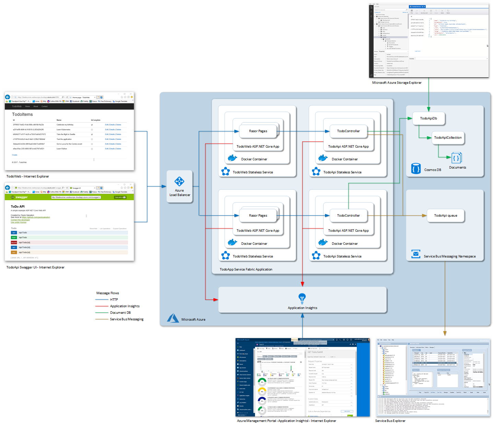  

# Kubernetes Architecture #

The following picture shows the architecture of the **Kubernetes** application running on **Azure Container Service**.

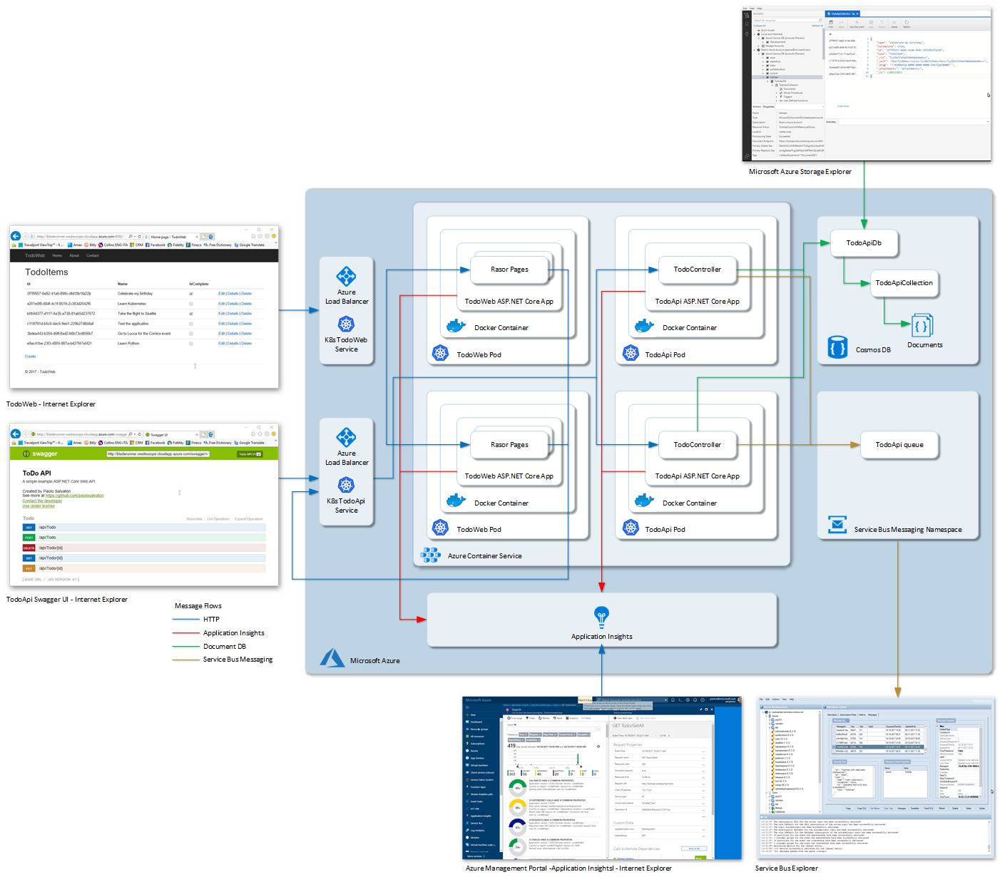 

**Note**: this diagram represents a simplification of the actual implementation of **Kubernetes Services** as it omits important entities such **kube-proxy**, **Iptables**, **Service Types**, etc. For more information, see [Kubernetes Services](https://kubernetes.io/docs/concepts/services-networking/service/#internal-load-balancer).

# Configuration #
In ASP.NET Core, the configuration API provides a way of configuring an app based on a list of name-value pairs. Configuration is read at runtime from multiple sources. The name-value pairs can be grouped into a multi-level hierarchy. There are configuration providers for: 

- File formats (INI, JSON, and XML)
- ommand-line arguments
- Environment variables
- In-memory .NET objects
- An encrypted user store
- Azure Key Vault
- Custom providers, which you install or create

## TodoApi Service Configuration ##
The following table contains the configuration of the **TodoApi** service defined in the **appsettings.json** file. 

```json
{
  "AzureKeyVault": {
  "Certificate": {
    "CertificateEnvironmentVariable": "",
    "KeyEnvironmentVariable": ""
  },
  "ClientId": "",
  "Name": ""
  },
  "RepositoryService": {
      "CosmosDb": {
          "EndpointUri": "",
          "PrimaryKey": "",
          "DatabaseName": "",
          "CollectionName": ""
      }
  },
  "NotificationService": {
      "ServiceBus": {
          "ConnectionString": "",
          "QueueName": ""
      }
  },
  "DataProtection": {
    "BlobStorage": {
      "ConnectionString": "",
      "ContainerName": ""
    }
  },
  "ApplicationInsights": {
      "InstrumentationKey": ""
  },
  "Logging": {
      "IncludeScopes": false,
      "Debug": {
          "LogLevel": {
              "Default": "Information"
          }
      },
      "Console": {
          "LogLevel": {
              "Default": "Information"
          }
      },
      "EventSource": {
          "LogLevel": {
              "Default": "Warning"
          }
      },
      "ApplicationInsights": {
          "LogLevel": {
              "Default": "Information"
          }
      }
  }
}
```

**Notes**

- The **AzureKeyVault** section should be used only when storing secret values in **Azure Key Vault**, otherwise it can be ignored. It contains the following data:
  - **CertificateEnvironmentVariable**: indicates the name of the environment variable that contains the path to the certificate file used by the service to authenticate against **Azure Key Vault**. The file in question is a .pfx file when using Windows containers, and a .pem file when using Linux containers.
  - **KeyEnvironmentVariable**: indicates the name of the environment variable that contains the path to the key of the certificate used by the service to authenticate against **Azure Key Vault**. The file in question is a text file containing the password for the .pfx file when using Windows containers, and a .key certificate containing the private key of the .pem certificate when using Linux containers.
  - **ClientId**: contains the **ApplicationId** of the **Azure Active Directory Service Principal** used by the service to authenticate against **Azure Key Vault** using the certificate as credentials.
  - **Name**: contains the name of the **Azure Key Vault** used by the application to store credentials.
- The **RepositoryService** element contains the **CosmosDb** element which in turn contains the **EndpointUri**, **PrimaryKey**, **DatabaseName** and **CollectionName** of the DocumentDB database holding the data.
- The **NotificationService** element contains the **ServiceBus** element which in turn contains the **ConnectionString** of the Service Bus namespace used by the notification service and the **QueueName** setting which holds the name of the queue where the backend service sends a message any time a CRUD operation is performed on a document.
- The **DataProtection** element contains the **BlobStorage** element which in turn contains the **ConnectionString** of the storage account used by the data protection and the **ContainerName** setting which holds the name of the container where the data protection system stores the key. For more information, see [Data Protection in ASP.NET Core](https://docs.microsoft.com/en-us/aspnet/core/security/data-protection/).
- The **Application Insights** element contains the **InstrumentationKey** of the **Application Insights** used by the service for diagnostics, logging, performance monitoring, analytics and alerting.
- The **Logging*** element contains the log level for the various logging providers.

## TodoWeb Service Configuration ##
The following table contains the configuration of the **TodoWeb** service defined in the **appsettings.json** file. 

```json
{
  "AzureKeyVault": {
    "Certificate": {
      "CertificateEnvironmentVariable": "",
      "KeyEnvironmentVariable": ""
    },
    "ClientId": "",
    "Name": ""
  },
  "TodoApiService": {
    "EndpointUri": ""
  },
  "DataProtection": {
    "BlobStorage": {
      "ConnectionString": "",
      "ContainerName": ""
    }
  },
  "Logging": {
    "IncludeScopes": false,
    "LogLevel": {
      "Default": "Warning"
    },
    "ApplicationInsights": {
      "LogLevel": {
        "Default": "Information"
      }
    }
  },
  "ApplicationInsights": {
    "InstrumentationKey": ""
  }
}
```

**Notes**

- The **AzureKeyVault** section should be used only when storing secret values in **Azure Key Vault**, otherwise it can be ignored. It contains the following data:
  - **CertificateEnvironmentVariable**: indicates the name of the environment variable that contains the path to the certificate file used by the service to authenticate against **Azure Key Vault**. The file in question is a .pfx file when using Windows containers, and a .pem file when using Linux containers.
  - **KeyEnvironmentVariable**: indicates the name of the environment variable that contains the path to the key of the certificate used by the service to authenticate against **Azure Key Vault**. The file in question is a text file containing the password for the .pfx file when using Windows containers, and a .key certificate containing the private key of the .pem certificate when using Linux containers.
  - **ClientId**: contains the **ApplicationId** of the **Azure Active Directory Service Principal** used by the service to authenticate against **Azure Key Vault** using the certificate as credentials.
  - **Name**: contains the name of the **Azure Key Vault** used by the application to store credentials.
- The **TodoApiService** element contains the **EndpointUri** of the **todoapi**. In **Service Fabric** this setting will be the DNS names assigned to the **todoapi** service. For more information, see [DNS Service in Azure Service Fabric](https://docs.microsoft.com/en-us/azure/service-fabric/service-fabric-dnsservice). In **Kubernetes** this setting will contain the name of the **todoapi** service. For more information on Kubernetes Services, see [Services](https://kubernetes.io/docs/concepts/services-networking/service/).
- The **DataProtection** element contains the **BlobStorage** element which in turn contains the **ConnectionString** of the storage account used by the data protection and the **ContainerName** setting which holds the name of the container where the data protection system stores the key. For more information, see [Data Protection in ASP.NET Core](https://docs.microsoft.com/en-us/aspnet/core/security/data-protection/).
- The **Application Insights** element contains the **InstrumentationKey** of the **Application Insights** used by the service for diagnostics, logging, performance monitoring, analytics and alerting.
- The **Logging*** element contains the log level for the various logging providers.

## How Configuration works in ASP.NET Core ##
The [CreateDefaultBuilder](https://andrewlock.net/exploring-program-and-startup-in-asp-net-core-2-preview1-2/) extension method in an ASP.NET Core 2.x app adds configuration providers for reading JSON files and system configuration sources:

- appsettings.json
- appsettings.<EnvironmentName>.json
- environment variables

ASP.NET Core allows to use additional configuration providers to read settings from a heterogeneous range of repositories. Later in this document, we'll see how to:

 - Create an [Azure Key Vault](https://docs.microsoft.com/en-us/azure/key-vault/key-vault-manage-with-cli2) using the Azure CLI.
 - Create secrets in this repository using the Azure CLI
 - Use the [Azure Key Vault configuration provider](https://docs.microsoft.com/en-us/aspnet/core/security/key-vault-configuration?tabs=aspnetcore2x) in the application to read sensitive parameters from the vault. 
 
 Configuration consists of a hierarchical list of name-value pairs in which the nodes are separated by a colon. To retrieve a value, access the Configuration indexer with the corresponding item's key. For example, if you want to retrieve the value of the **QueueName** setting from the configuration of the **todoapi** service, you have to use the following format.

```csharp
var queueName = Configuration["NotificationService:ServiceBus:QueueName"];
```

If you want to create an environment variable to provide a value for a setting defined in the **appsettings.json** file, you can replace : (colon) with __ (double underscore).

```Dockerfile
NotificationService__ServiceBus__QueueName=todoapi
```


The [CreateDefaultBuilder](https://andrewlock.net/exploring-program-and-startup-in-asp-net-core-2-preview1-2/)  helper method specifies environment variables last, so that the local environment can override anything set in deployed configuration files. This allows allows to define settings in the **appsettings.json** file, but leave their value empty, and specify their value using environment variables. 

For more information on configuration, see the following resources:

- [Configuration in ASP.NET Core](https://docs.microsoft.com/en-us/aspnet/core/fundamentals/configuration?tabs=basicconfiguration)
- [Managing ASP.NET Core App Settings on Kubernetes](https://anthonychu.ca/post/aspnet-core-appsettings-secrets-kubernetes/)
- [ASP.NET Core and Docker Environment Variables](https://www.scottbrady91.com/Docker/ASPNET-Core-and-Docker-Environment-Variables)

## How to define the Docker images and containers ##
Using [Visual Studio Tools for Docker](https://docs.microsoft.com/en-us/aspnet/core/publishing/visual-studio-tools-for-docker), I built an image based the on the **microsoft/aspnetcore:2.0** standard image.
Then, the tool creates a Dockerfile for both the frontend and backend service that you can later customize at will. The Dockerfile contains instructions for setting up the environment inside your container, loading the application you want to run, and mapping ports. The Dockerfile is the input to the docker build command, which creates the image. Below you can see the **Dockerfile** of the **todoapi** and **todoweb** services.

**TodoApi Dockerfile**
```dockerfile
FROM microsoft/aspnetcore:2.0
ARG source
WORKDIR /app
EXPOSE 80
COPY ${source:-obj/Docker/publish} .
ENTRYPOINT ["dotnet", "TodoApi.dll"]

```

**TodoWeb Dockerfile** 
```dockerfile
FROM microsoft/aspnetcore:2.0
ARG source
WORKDIR /app
EXPOSE 80
COPY ${source:-obj/Docker/publish} .
ENTRYPOINT ["dotnet", "TodoWeb.dll"]

```

The [Visual Studio Tools for Docker](https://docs.microsoft.com/en-us/aspnet/core/publishing/visual-studio-tools-for-docker) also creates the **docker-compose.yml** and **docker-compose-override.yml** files that you can use to test the application locally.

**docker-compose.yml**
```yaml
version: '3'

services:
  todoapi:
    image: todoapi
    build:
      context: ./TodoApi
      dockerfile: Dockerfile

  todoweb:
    image: todoweb
    build:
      context: ./TodoWeb
      dockerfile: Dockerfile

```

**docker-compose-override.yml**
```yaml
version: '3'

services:
  todoapi:
    environment:
      - ASPNETCORE_ENVIRONMENT=Development
      - RepositoryService__CosmosDb__EndpointUri=COSMOS_DB_ENDPOINT_URI
      - RepositoryService__CosmosDb__PrimaryKey=COSMOS_DB_PRIMARY_KEY
      - RepositoryService__CosmosDb__DatabaseName=TodoApiDb
      - RepositoryService__CosmosDb__CollectionName=TodoApiCollection
      - NotificationService__ServiceBus__ConnectionString=SERVICE_BUS_CONNECTION_STRING
      - NotificationService__ServiceBus__QueueName=todoapi
      - DataProtection__BlobStorage__ConnectionString=STORAGE_ACCOUNT_CONNECTION_STRING
      - DataProtection__BlobStorage__ContainerName=todoapi
      - ApplicationInsights__InstrumentationKey=APPLICATION_INSIGHTS_INSTRUMENTATION_KEY

    ports:
      - "80"

  todoweb:
    environment:
      - ASPNETCORE_ENVIRONMENT=Development
      - TodoApiService__EndpointUri=todoapi
      - DataProtection__BlobStorage__ConnectionString=STORAGE_ACCOUNT_CONNECTION_STRING
      - DataProtection__BlobStorage__ContainerName=todoweb
      - ApplicationInsights__InstrumentationKey=APPLICATION_INSIGHTS_INSTRUMENTATION_KEY
    ports:
      - "80"
```

**Configuration**

Before debugging the application in Visual Studio, make the following changes to the **docker-compose-override.yml** file:

- Replace **COSMOS_DB_ENDPOINT_URI** with the endpoint URI of your **Cosmos DB**.
- Replace **COSMOS_DB_PRIMARY_KEY** with the primary key of your **Cosmos DB**.
- Replace **COSMOS_DB_PRIMARY_KEY** with the primary key of your **Cosmos DB**.
- Replace **SERVICE_BUS_CONNECTION_STRING** with the connection string of your **Service Bus Messaging** namespace.
- Replace **STORAGE_ACCOUNT_CONNECTION_STRING** with the connection string of the **Storage Account** used by **ASP.NET Core Data  Protection**
- Replace **APPLICATION_INSIGHTS_INSTRUMENTATION_KEY** with the instrumentation key of the **Application Insights** resource used to monitor the multi-container application.

When using **Azure Key Vault** to store secrets, and **Linux Containers** to run the front-end and back-end services, you should use the following docker compose file to debug the application locally in Visual Studio. When deploying and running the application on **AKS**, where sensitive data is stored as secrets in the **Kubernetes** cluster, you can ignore this part.

**docker-compose-override.yml**
```yaml
version: '3'

services:
  todoapi:
    environment:
      - ASPNETCORE_ENVIRONMENT=Development
      - NotificationService__ServiceBus__QueueName=todoapi
      - DataProtection__BlobStorage__ContainerName=todoapi
      - AzureKeyVault__Certificate__CertificateEnvironmentVariable=Certificates_TodoApiPkg_Code_TodoListCert_PEM
      - AzureKeyVault__Certificate__KeyEnvironmentVariable=Certificates_TodoApiPkg_Code_TodoListCert_PrivateKey
      - AzureKeyVault__ClientId=AZURE_AD_APPLICATION_ID
      - AzureKeyVault__Name=AZURE_KEY_VAULT_NAME
      - Certificates_TodoApiPkg_Code_TodoListCert_PEM=/pem/KeyVaultCertificate.pem
      - Certificates_TodoApiPkg_Code_TodoListCert_PrivateKey=/pem/KeyVaultCertificate.key
    ports:
      - "80"
    volumes:
      - C:\Temp\Pem:/pem

  todoweb:
    environment:
      - ASPNETCORE_ENVIRONMENT=Development
      - TodoApiService__EndpointUri=todoapi
      - DataProtection__BlobStorage__ContainerName=todoweb
      - AzureKeyVault__Certificate__CertificateEnvironmentVariable=Certificates_TodoApiPkg_Code_TodoListCert_PEM
      - AzureKeyVault__Certificate__KeyEnvironmentVariable=Certificates_TodoApiPkg_Code_TodoListCert_PrivateKey
      - AzureKeyVault__ClientId=AZURE_AD_APPLICATION_ID
      - AzureKeyVault__Name=AZURE_KEY_VAULT_NAME
      - Certificates_TodoApiPkg_Code_TodoListCert_PEM=/pem/KeyVaultCertificate.pem
      - Certificates_TodoApiPkg_Code_TodoListCert_PrivateKey=/pem/KeyVaultCertificate.key
    ports:
      - "80"
    volumes:
      - C:\Temp\Pem:/pem
```

**Configuration**

Before debugging the solution in Visual Studio, make sure accomplish the following tasks:

  - Run the **CreateKeyVault.cmd** batch script to create the **Azure Key Vault** used by the application. For more information, see [Manage Key Vault using CLI 2.0](https://docs.microsoft.com/en-us/azure/key-vault/key-vault-manage-with-cli2).

  - Open the **AddSecretsToKeyVault.cmd** file, substitute the placeholders with the real value for secret parameters (e.g. Service Bus connection string) and run the batch script to add secrets to the **Azure Key Vault** created at the previous step.

  - Run the **CreateAADApplication.ps1** this PowerShell script to create an **Azure Active Directory Application** using the **KeyVaultCertificate.cer** certificate as credentials, to create an **Azure Active Directory Service Principal** for the application and finally to associate the service principal with the **Azure Key Vault** used by the application as repository for secrets. 

 - Create a local folder (e.g. C:\Temp\Pem) and copy the **KeyVaultCertificate.pem** and **KeyVaultCertificate.key** containing, respectively, the public and private key of the certificate used by the frontend and backend service along to authenticate against **Azure Key Vault**.


 - Make the following changes to the **docker-compose-override.yml** file:

    - Replace **AZURE_AD_APPLICATION_ID** with the **Application ID** of the **Azure Active Directory Service Principal** used by the frontend and backend services to authenticate against **Azure Key Vault**.
    - Replace **AZURE_KEY_VAULT_NAME** with the name of the **Azure Key Vault** used by the application.


## Push Docker images to Docker Hub ##
You can execute the following command file to tag and register the images in your repository on [Docker Hub](https://hub.docker.com). Make sure to replace the placeholder **DOCKER_HUB_REPOSITORY** with the name of your repository on **Docker Hub** before running the batch file.

**push-images-to-docker-hub.cmd**
```batchfile
REM login to docker hub
docker login -u DOCKER_HUB_REPOSITORY -p DOCKER_HUB_PASSWORD

REM tag the local todoapi:latest image with the name of the DOCKER_HUB_REPOSITORY
docker tag todoapi:latest DOCKER_HUB_REPOSITORY/todoapi:v1

REM push the image DOCKER_HUB_REPOSITORY/todoapi:latest to the DOCKER_HUB_REPOSITORY
docker push DOCKER_HUB_REPOSITORY/todoapi:v1

REM tag the local todoweb:latest image with the name of the DOCKER_HUB_REPOSITORY
docker tag todoweb:latest DOCKER_HUB_REPOSITORY/todoweb:v1

REM push the image DOCKER_HUB_REPOSITORY/todoweb:latest to the DOCKER_HUB_REPOSITORY 
docker push DOCKER_HUB_REPOSITORY/todoweb:v1

REM browse to https://hub.docker.com/r/DOCKER_HUB_REPOSITORY/
start chrome https://hub.docker.com/r/DOCKER_HUB_REPOSITORY/
```

**Configuration**

Before running the above script file, make the following changes:

- **DOCKER_HUB_REPOSITORY** with your **Docker Hub** username.
- **DOCKER_HUB_PASSWORD** with your **Docker Hub** password.


Alternatively, you can register and deploy your images from the [Azure Container Registry](https://docs.microsoft.com/en-gb/azure/container-registry/container-registry-intro). Let's see how you can perform this task.

## Create an Azure Container Registry ##
The [Azure Container Registry](https://docs.microsoft.com/en-us/azure/container-registry/) is a managed Docker registry service based on the open-source Docker Registry 2.0. This repository can be used to store images for container deployments [Aaure Container Service](https://docs.microsoft.com/en-us/azure/container-service/index), [Azure App Service](https://docs.microsoft.com/en-us/app-service/index.md), [Azure Batch](https://docs.microsoft.com/en-us/azure/batch/index), [Azure Service Fabric](https://docs.microsoft.com/en-us/azure/service-fabric/), and others. For more information, see [Introduction to private Docker container registries in Azure](https://docs.microsoft.com/en-us/azure/container-registry/container-registry-intro). You can run the following script to create an [Azure Container Registry](https://docs.microsoft.com/en-us/azure/container-registry/). Make sure to replace the placeholder **AZURE_CONTAINER_REGISTRY** with the name of your  **Azure Container Registry** before running the batch file.

**create-azure-container-registry.cmd**
```batchfile
REM Create a resource group for the Azure Container Registry
az group create --name ContainerRegistryResourceGroup --location westus2 --output jsonc

REM Create an Azure Container Registry. The name of the Container Registry must be unique
az acr create --resource-group ContainerRegistryResourceGroup --name AZURE_CONTAINER_REGISTRY --sku Basic --admin-enabled true

REM Login to the newly created Azure Container Registry
az acr login --name AZURE_CONTAINER_REGISTRY
```
## Push Docker images to Azure Container Registry ##
You can execute the following command file to tag and register the images in your repository on [Docker Hub](https://hub.docker.com). Make sure to replace the placeholder **AZURE_CONTAINER_REGISTRY** with the name of your **Azure Container Registry** before running the batch file.

**push-images-to-azure-container-registry.cmd**
```batchfile
REM Login to the newly created Azure Container Registry
call az acr login --name AZURE_CONTAINER_REGISTRY

REM Each container image needs to be tagged with the loginServer name of the registry. 
REM This tag is used for routing when pushing container images to an image registry.
REM Save the loginServer name to the AKS_CONTAINER_REGISTRY environment variable
for /f "delims=" %%a in ('call az acr list --resource-group ContainerRegistryResourceGroup --query "[].{acrLoginServer:loginServer}" --output tsv') do @set AKS_CONTAINER_REGISTRY=%%a

REM tag the local todoapi:latest image with the loginServer of the container registry
docker tag todoapi:latest %AKS_CONTAINER_REGISTRY%/todoapi:v1

REM publish <container registry>/todoapi:latest to the container registry on Azure
docker push %AKS_CONTAINER_REGISTRY%/todoapi:v1

REM tag the local todoweb:latest image with the loginServer of the container registry
docker tag todoweb:latest %AKS_CONTAINER_REGISTRY%/todoweb:v1

REM publish <container registry>/todoweb:latest to the container registry on Azure
docker push %AKS_CONTAINER_REGISTRY%/todoweb:v1

REM List images in the container registry on Azure
call az acr repository list --name AZURE_CONTAINER_REGISTRY --output table
```
# Storing secret parameters in Azure Key Vault #
If you plan to deploy the application to a **Service Fabric** Windows or Linux cluster in Azure, you should store sensitive data like connection strings, password, or instrumentation keys in **Azure Key Vault**. The frontend and backend services that compose the multi-container application in this sample are **ASP.NET Core** projects. ASP.NET Core supplies a configuration provider for [Azure Key Vault](https://azure.microsoft.com/en-us/services/key-vault/) in the [Microsoft.Extensions.Configuration.AzureKeyVault](https://www.nuget.org/packages/Microsoft.Extensions.Configuration.AzureKeyVault/) NuGet package. This configuration provider allows an application to use the **Application Id** and **Application Key** of an **Azure Active Directory Application** to authenticate against **Azure Key Vault** as explained at [Azure Key Vault configuration provider](https://docs.microsoft.com/en-us/aspnet/core/security/key-vault-configuration?tabs=aspnetcore2x). 
However, the approach explained in the documentation requires to define the ClientId and ClientSecret in the service configuration, but this technique is not safe, because a malicious user could use and use these credentials to access secrets in **Azure Key Vault**. 
Another way to authenticate an Azure AD application is by using a Client ID and a Certificate instead of a Client ID and Client Secret. Following are the steps to use a Certificate in an Azure Web App:

 - Get or create a certificate
 - Associate the certificate with an Azure AD application
 - Add code to your ASP.NET Core application to use the certificate

## Get or Create a Certificate ##

For our purposes, we will make a test certificate. Here are a couple of commands that you can use in a command prompt to create a certificate. Change directory to where you want the cert files created. Also, for the beginning and ending date of the certificate, use the current date plus 1 year.

```batchfile
makecert -sv KeyVaultCertificate.pvk -n "cn=TodoListApp" KeyVaultCertificate.cer -b 01/01/2018 -e 12/31/2030 -r
pvk2pfx -pvk KeyVaultCertificate.pvk -spc KeyVaultCertificate.cer -pfx KeyVaultCertificate.pfx -po trustno1
```

Make note of the password for the .pfx (in this example: trustno1). You will need it below. If you are planning to deploy the sample application to an **Azure Service Fabric Windows** cluster, the .pfx and .cer files created will suffice your needs. Instead, if you plan to deploy the application to an **Azure Service Fabric Linux** cluster, and you want to debug the frontend and backend service locally, you will need to create a .pem file and a .key file starting from the .pfx file using the following commands: 

```batchfile
openssl pkcs12 -in KeyVaultCertificate.pfx -out KeyVaultCertificatePEM.pem -nodes -nokeys
openssl pkcs12 -in KeyVaultCertificate.pfx -out KeyVaultCertificatePEM.key -nodes -nocerts
```
## Create a Key Vault using Azure CLI ##

In order to protect sensitive data from unauthorized users, you should store secrets in Key Vault. The following script can be used to create an **Azure Key Vault**:

**CreateKeyVault.cmd**
```batchfile
REM Create a Resource Group for Key Vault
call az group create --name TodoListKeyVaultResourceGroup --location WestEurope

REM Create Key Vault
call az keyvault create --name TodoListKeyVault --resource-group TodoListKeyVaultResourceGroup
```
## Add secrets to Azure Key Vault using Azure CLI ##
To add sensitive configuration data to **Azure Key Vault**, you can use the following script:

**AddSecretsToKeyVault.cmd**
```batchfile
REM add Cosmos DB Endpoint URI secret to Key Vault
call az keyvault secret set --name RepositoryService--CosmosDb--EndpointUri --vault-name TodoListKeyVault  --value "COSMOS_DB_ENDPOINT_URI" --description "Cosmos DB endpoint URI"

REM add Cosmos DB Primary Key secret to Key Vault
call az keyvault secret set --name RepositoryService--CosmosDb--PrimaryKey --vault-name TodoListKeyVault  --value "COSMOS_DB_PRIMARY_KEY --description "Cosmos DB primary key"

REM add Cosmos DB Database Name secret to Key Vault
call az keyvault secret set --name RepositoryService--CosmosDb--DatabaseName --vault-name TodoListKeyVault  --value "COSMOS_DB_DATABASE_NAME" --description "Cosmos DB database name"

REM add Cosmos DB Collection Name secret to Key Vault
call az keyvault secret set --name RepositoryService--CosmosDb--CollectionName --vault-name TodoListKeyVault  --value "COSMOS_DB_COLLECTION_NAME" --description "Cosmos DB collection name"

REM add Service Bus Connection String secret to Key Vault
call az keyvault secret set --name NotificationService--ServiceBus--ConnectionString --vault-name TodoListKeyVault  --value "SERVICE_BUS_CONNECTION_STRING" --description "Service Bus connection string"

REM add Data Protection Blob Storage Connection String secret to Key Vault
call az keyvault secret set --name DataProtection--BlobStorage--ConnectionString --vault-name TodoListKeyVault  --value "STORAGE_ACCOUNT_CONNECTION_STRING" --description "Data Protection blob storage connection string"

REM add Application Insights Instrumentation Key secret to Key Vault
call az keyvault secret set --name ApplicationInsights--InstrumentationKey --vault-name TodoListKeyVault  --value "APPLICATION_INSIGHTS_INSTRUMENTATION_KEY" --description "Application Insights instrumentation key"

REM List secrets in Key Vault
call az keyvault secret list --vault-name TodoListKeyVault --output table
```
**Configuration**

Before running the above script, make the following changes:

- Replace **COSMOS_DB_ENDPOINT_URI** with the endpoint URI of your **Cosmos DB**.
- Replace **COSMOS_DB_PRIMARY_KEY** with the primary key of your **Cosmos DB**.
- Replace **COSMOS_DB_DATABASE_NAME** with the **Cosmos DB** database name.
- Replace **COSMOS_DB_COLLECTION_NAME** with the **Cosmos DB** collection name.
- Replace **SERVICE_BUS_CONNECTION_STRING** with the connection string of your **Service Bus Messaging** namespace.
- Replace **STORAGE_ACCOUNT_CONNECTION_STRING** with the connection string of the **Storage Account** used by **ASP.NET Core Data  Protection**
- Replace **APPLICATION_INSIGHTS_INSTRUMENTATION_KEY** with the instrumentation key of the **Application Insights** resource used to monitor the multi-container application.

## Associate the certificate with an Azure AD application ##
The next step is to associate the certificate with an Azure AD Application. Presently, the Azure portal does not support this workflow; this can be completed through PowerShell. Run the following commands to associate the certificate with a new Azure AD application called **ServiceFabricTodoListApp**:

**CreateAADApplication.ps1**
```PowerShell
# Login to Azure Resource Manager
Login-AzureRmAccount

# Select a default subscription for your current session in case your account has multiple Azure subscriptions
Get-AzureRmSubscription –SubscriptionName "SUBSCRIPTION-NAME" | Select-AzureRmSubscription

# Variables
$pfxFile = $PSScriptRoot + '\KeyVaultCertificate.cer'
$displayName = "ServiceFabricTodoListApp"
$appUrl = "http://ServiceFabricTodoListApp"a
$keyVaultName = "TodoListKeyVault"
$keyVaultResourceGroup = "TodoListKeyVaultResourceGroup"

# Get certificate from file
$x509 = New-Object System.Security.Cryptography.X509Certificates.X509Certificate2
$x509.Import($pfxFile)

# Get certificate raw data in base64 format
$credValue = [System.Convert]::ToBase64String($x509.GetRawCertData())

# Create a new Azure AD application for TodoListApp
$adapp = New-AzureRmADApplication -DisplayName $displayName `
                                  -HomePage $appUrl `
                                  -IdentifierUris $appUrl `
                                  -CertValue $credValue `
                                  -StartDate $x509.NotBefore `
                                  -EndDate $x509.NotAfter

# Create a new Azure AD service proncipal for the Azure AD TodoListApp application
$sp = New-AzureRmADServicePrincipal -ApplicationId $adapp.ApplicationId

# Grants permissions for a user, application, or security group to perform operations with a key vault.
Set-AzureRmKeyVaultAccessPolicy -VaultName $keyVaultName `
                                -ResourceGroupName $keyVaultResourceGroup `
                                -ServicePrincipalName $adapp.ApplicationId `
                                -PermissionsToSecrets all

# get the thumbprint to use in your app settings
$x509.Thumbprint

# get the application id to use in your app settings
$adapp.ApplicationId
```
After you have run these commands, you can see the application in Azure AD. Make sure to take note of the certificate thumbprint and ApplicationId printed out by the script. To learn more about Azure AD Application Objects and ServicePrincipal Objects, see [Application Objects and Service Principal Objects](https://docs.microsoft.com/en-us/azure/active-directory/develop/active-directory-application-objects).

## How Service Fabric passes a certificate to a container ##
Service Fabric provides a mechanism for services running inside a container to access a certificate that is installed on the nodes in a Windows or Linux cluster. 
You can secure your container services by specifying a certificate. The certificate information is provided in the application manifest under the **ContainerHostPolicies** tag as the following snippet shows:

```XML
<ContainerHostPolicies CodePackageRef="NodeContainerService.Code">
    <CertificateRef Name="MyCert1" X509StoreName="My" X509FindValue="[Thumbprint1]"/>
    <CertificateRef Name="MyCert2" X509FindValue="[Thumbprint2]"/>
```
For windows clusters, when starting the application, the runtime reads the certificates and generates a .pfx file and password for each certificate. This .pfx file and password file are accessible inside the container using the following environment variables:

 - Certificates_ServicePackageName_CodePackageName_CertName_PFX
 - Certificates_ServicePackageName_CodePackageName_CertName_Password

For Linux clusters, the certificates as .pem files are simply copied over from the store specified by X509StoreName onto the container. The corresponding environment variables on Linux are:

 - Certificates_ServicePackageName_CodePackageName_CertName_PEM
 - Certificates_ServicePackageName_CodePackageName_CertName_PrivateKey

Alternatively, if you already have the certificates in the required form and would simply want to access it inside the container, you can create a data package inside your app package and specify the following inside your application manifest:

```XML
<ContainerHostPolicies CodePackageRef="NodeContainerService.Code">
   <CertificateRef Name="MyCert1" DataPackageRef="[DataPackageName]" DataPackageVersion="[Version]" RelativePath="[Relative Path to certificate inside DataPackage]" Password="[password]" IsPasswordEncrypted="[true/false]"/>
```
For more information on how to configure certificates for a containerized service in Service Fabric, see [Container Security](https://docs.microsoft.com/en-us/azure/service-fabric/service-fabric-securing-containers). 
For more information on manage certificates used by a Service Fabric cluster in Azure, see [Add or remove certificates for a Service Fabric cluster in Azure](https://docs.microsoft.com/en-us/azure/service-fabric/service-fabric-cluster-security-update-certs-azure).

## How to read the certificate from code and initialize Key Vault configuration provider ##
When deploying the application to a **Service Fabric Linux** cluster in Azure, you need to specify a certificate in the **CertificateRef** inside the **ContainerHostPolicies** of both the frontend and backend service, using one of the techniques described in the previous section. Service Fabric will copy the certificate files inside the container and will create two environment variables that will contain the path of:

 - .pfx and password files in a Windows cluster
 - .pem and .key files in a Linux cluster.

Below you can see the code used by the **Program** class of the **TodoApi** service.  

**Program.cs**
```CSharp
using System;
using Microsoft.AspNetCore;
using Microsoft.AspNetCore.Hosting;
using Microsoft.Extensions.Configuration;

namespace TodoApi
{
    public class Program
    {
        public static void Main(string[] args)
        {
            BuildWebHost(args).Run();
        }

        public static IWebHost BuildWebHost(string[] args)
        {
            var builder = WebHost.CreateDefaultBuilder(args)
                .UseApplicationInsights()
                .CaptureStartupErrors(true)
                .UseSetting(WebHostDefaults.DetailedErrorsKey, "true")
                .ConfigureAppConfiguration(ConfigConfiguration)
                .UseStartup<Startup>()
                .Build();

            return builder;
        }

        private static void ConfigConfiguration(WebHostBuilderContext webHostBuilderContext, IConfigurationBuilder configurationBuilder)
        {
            var configuration = configurationBuilder.Build();

            // Read the name of the environment variable set by Service Fabric that contain the location of the PEM file
            var certificateEnvironmentVariable = configuration["AzureKeyVault:Certificate:CertificateEnvironmentVariable"];
            if (string.IsNullOrWhiteSpace(certificateEnvironmentVariable))
            {
                return;
            }

            // Read the name of the environment variable set by Service Fabric that contain the location of the KEY file
            var keyEnvironmentVariable = configuration["AzureKeyVault:Certificate:KeyEnvironmentVariable"];
            if (string.IsNullOrWhiteSpace(keyEnvironmentVariable))
            {
                return;
            }

            // Read the client ID
            var clientId = configuration["AzureKeyVault:ClientId"];
            if (string.IsNullOrWhiteSpace(clientId))
            {
                return;
            }

            // Read the name of the Azure Key Vault
            var name = configuration["AzureKeyVault:Name"];
            if (string.IsNullOrWhiteSpace(name))
            {
                return;
            }

            // Read the location of the certificate file from the environment variable
            var certificateFilePath = Environment.GetEnvironmentVariable(certificateEnvironmentVariable);
            if (string.IsNullOrWhiteSpace(certificateFilePath))
            {
                return;
            }

            // Read the location of the key file from the environment variable
            var keyFilePath = Environment.GetEnvironmentVariable(keyEnvironmentVariable);
            if (string.IsNullOrWhiteSpace(keyFilePath))
            {
                return;
            }

            // Read the certificate used to authenticate against Azure Key Vault
            var certificate = Helpers.CertificateHelper.GetCertificateAsync(certificateFilePath, keyFilePath).Result;
            if (certificate == null)
            {
                return;
            }

            // Configure the application to read settings from Azure Key Vault
            configurationBuilder.AddAzureKeyVault($"https://{name}.vault.azure.net/",
                                                  clientId,
                                                  certificate);
        }
    }
}
```
**Remarks**

The **ConfigureAppConfiguration** method performs the following actiosn:

 - Reads the name of the environment variable initialized by Service Fabric which holds the path of the .pfx (Windows) or .pem (Linux) file from the **AzureKeyVault__Certificate__CertificateEnvironmentVariable** environment variable.
 - Reads the name of the environment variable initialized by Service Fabric which holds the path of the password (Windows) or .key (Linux) file from the **AzureKeyVault__Certificate__KeyEnvironmentVariable** environment variable.
 - Reads the **Azure AD Application Id** used to authenticate against **Azure Key Vault** from the **AzureKeyVault__ClientId** environment variable.
- Reads the name of the **Azure Key Vault** from the **AzureKeyVault__Name** environment variable.  
- Reads the path of the .pfx (Windows) or .pem (Linux) file from the environment variable initialized by Service Fabric.
- Reads the path of the password (Windows) or .pem (Linux) file from the environment variable initialized by Service Fabric.
- Calls the **CertificateHelper.GetCertificateAsync** method to retrieve a [X509Certificate2](https://msdn.microsoft.com/en-us/library/system.security.cryptography.x509certificates.x509certificate2(v=vs.110).aspx) object which contains the certificate used to authenticate against **Azure Key Vault**.
- Add the **Azure Key Vault** configuration provider to the application.

Below you can see the code of the **CertificateHelper.GetCertificateAsync** method:

```CSharp
public static async Task<X509Certificate2> GetCertificateAsync(string certificateFilePath, string keyFilePath)
{
    // Validate parameters
    if (string.IsNullOrEmpty(certificateFilePath))
    {
        throw new ArgumentException($"{nameof(certificateFilePath)} parameter cannot bu null or empty.", nameof(certificateFilePath));
    }

    if (string.IsNullOrEmpty(keyFilePath))
    {
        throw new ArgumentException($"{nameof(keyFilePath)} parameter cannot bu null or empty.", nameof(keyFilePath));
    }

    if (!File.Exists(certificateFilePath))
    {
        throw new FileNotFoundException($"{certificateFilePath} file not found.", certificateFilePath);
    }

    if (!File.Exists(keyFilePath))
    {
        throw new FileNotFoundException($"{keyFilePath} file not found.", keyFilePath);
    }

    if (Environment.OSVersion.Platform.ToString().ToLower().Contains("win"))
    {
        SetReadPermission(certificateFilePath);
        SetReadPermission(keyFilePath);
        var password = File.ReadAllLines(keyFilePath, Encoding.Default)[0];
        password = password.Replace("\0", string.Empty);
        var certificate = new X509Certificate2(certificateFilePath, password);
        return certificate;
    }
    else
    {
        var pemCertificate = await File.ReadAllTextAsync(certificateFilePath);
        var pemKey = await File.ReadAllTextAsync(keyFilePath);

        var certBuffer = GetBytesFromPem(pemCertificate, CertificateFileType.Certificate);
        var keyBuffer = GetBytesFromPem(pemKey, CertificateFileType.Pkcs8PrivateKey);

        var certificate = new X509Certificate2(certBuffer);
        var privateKey = DecodePrivateKeyInfo(keyBuffer);
        certificate = certificate.Copy​With​Private​Key(privateKey);
        return certificate;
    }
}
```

**Note**: the application uses the classes contained in the [System.Security.Cryptography.OpenSsl](https://www.nuget.org/packages/System.Security.Cryptography.OpenSsl/) NuGet package to read certificates in a Linux cluster.

# Service Fabric Deployment with Application Manifest and Service Manifests # 
In the Visual Studio solution you can find three projects to deploy the multi-container application to an **Azure Service Fabric Cluster**:

- **TodoAppFromAzureContainerRegistry**: this project allows to deploy the multi-container application to an **Azure Service Fabric Linux** cluster pulling the **Docker** images from an **Azure Container Registry**. 

  **IMPORTANT NOTE**: this project allows you to specify secret parameters in clear-text in the **Cloud.xml** file only for testing purposes without the need to store them in **Azure Key Vault**. We highly discourage to use this approach in a production environment and we strongly recommend you to store sensitive configuration data in **Azure Key Vault**.

- **TodoAppFromDockerHub**: this project allows to deploy the multi-container application to an **Azure Service Fabric Linux** cluster pulling the **Docker** images from a **Docker Hub** repository and reading sensitive configuration data from **Azure Key Vault**.

- **TodoAppForWindowsContainers**: this project allows to deploy the multi-container application to an **Azure Service Fabric Windows** cluster pulling the **Docker** images for **Windows Containers** from a **Docker Hub** repository and reading sensitive configuration data from **Azure Key Vault**.

The **Application Manifest**, **Service Manifest** and **Parameters** files of the two project are almost identical, the only things that differ are: 

- the repository used for pulling **Docker** images
- the credentials (username and password) used by **Service Fabric** to login to the repository.
- the name of the images used to create the containers for the **todoapi** and **todoweb** services.

## Deploy the application to a Linux cluster: parameters defined in the application manifest ##
As mentioned above, the **TodoAppFromAzureContainerRegistry** project allows you to specify secret parameters in clear-text in the **Cloud.xml** file only for testing purposes without the need to store them in **Azure Key Vault**. This technique should not be used to deploy an application to a production environment. Unathorized users could read sensitive data, like connection strings, keys and passwords, from the manifests stored in the source code repository (e.g. GitHub) or retrieve this data from the **Service Fabric Explorer** dashboard, once the application is deployed. This section shows the service manifests, application manifest and application parameters file contained in this project. Looking at the service manifests below, you can observe that all configuration data is passed to each service using environment variables.

**TodoApi ServiceManifest.xml**
```xml
<?xml version="1.0" encoding="utf-8"?>
<ServiceManifest Name="TodoApiPkg"
                 Version="1.0.0"
                 xmlns="http://schemas.microsoft.com/2011/01/fabric"
                 xmlns:xsd="http://www.w3.org/2001/XMLSchema"
                 xmlns:xsi="http://www.w3.org/2001/XMLSchema-instance">
  <ServiceTypes>
    <!-- This is the name of your ServiceType.
         The UseImplicitHost attribute indicates this is a guest service. -->
    <StatelessServiceType ServiceTypeName="TodoApiType" UseImplicitHost="true" />
  </ServiceTypes>

  <!-- Code package is your service executable. -->
  <CodePackage Name="Code" Version="1.0.0">
    <EntryPoint>
      <!-- Follow this link for more information about deploying Windows containers to Service Fabric: https://aka.ms/sfguestcontainers -->
      <ContainerHost>
        <ImageName>AZURE_CONTAINER_REGISTRY_NAME.azurecr.io/todoapi:v1</ImageName>
      </ContainerHost>
    </EntryPoint>
    <!-- Pass environment variables to your container: -->
    <EnvironmentVariables>
      <EnvironmentVariable Name="ASPNETCORE_ENVIRONMENT" Value=""/>
      <EnvironmentVariable Name="RepositoryService__CosmosDb__EndpointUri" Value=""/>
      <EnvironmentVariable Name="RepositoryService__CosmosDb__PrimaryKey" Value=""/>
      <EnvironmentVariable Name="RepositoryService__CosmosDb__DatabaseName" Value=""/>
      <EnvironmentVariable Name="RepositoryService__CosmosDb__CollectionName" Value=""/>
      <EnvironmentVariable Name="NotificationService__ServiceBus__ConnectionString" Value=""/>
      <EnvironmentVariable Name="NotificationService__ServiceBus__QueueName" Value=""/>
      <EnvironmentVariable Name="DataProtection__BlobStorage__ConnectionString" Value=""/>
      <EnvironmentVariable Name="DataProtection__BlobStorage__ContainerName" Value=""/>
      <EnvironmentVariable Name="ApplicationInsights__InstrumentationKey" Value=""/>
    </EnvironmentVariables>
  </CodePackage>

  <!-- Config package is the contents of the Config directoy under PackageRoot that contains an 
       independently-updateable and versioned set of custom configuration settings for your service. -->
  <ConfigPackage Name="Config" Version="1.0.0" />

  <Resources>
    <Endpoints>
      <!-- This endpoint is used by the communication listener to obtain the port on which to 
           listen. Please note that if your service is partitioned, this port is shared with 
           replicas of different partitions that are placed in your code. -->
      <Endpoint Name="TodoApiEndpoint" Port="80" UriScheme="http" Protocol="http"/>
    </Endpoints>
  </Resources>
</ServiceManifest>
```
**TodoWeb ServiceManifest.xml**
```xml
<?xml version="1.0" encoding="utf-8"?>
<ServiceManifest Name="TodoWebPkg"
                 Version="1.0.0"
                 xmlns="http://schemas.microsoft.com/2011/01/fabric"
                 xmlns:xsd="http://www.w3.org/2001/XMLSchema"
                 xmlns:xsi="http://www.w3.org/2001/XMLSchema-instance">
  <ServiceTypes>
    <!-- This is the name of your ServiceType.
         The UseImplicitHost attribute indicates this is a guest service. -->
    <StatelessServiceType ServiceTypeName="TodoWebType" UseImplicitHost="true" />
  </ServiceTypes>

  <!-- Code package is your service executable. -->
  <CodePackage Name="Code" Version="1.0.0">
    <EntryPoint>
      <!-- Follow this link for more information about deploying Windows containers to Service Fabric: https://aka.ms/sfguestcontainers -->
      <ContainerHost>
        <ImageName>AZURE_CONTAINER_REGISTRY_NAME.azurecr.io/todoweb:v1</ImageName>
      </ContainerHost>
    </EntryPoint>
    <!-- Pass environment variables to your container: -->
    <EnvironmentVariables>
      <EnvironmentVariable Name="ASPNETCORE_ENVIRONMENT" Value=""/>
      <EnvironmentVariable Name="TodoApiService__EndpointUri" Value=""/>
      <EnvironmentVariable Name="DataProtection__BlobStorage__ConnectionString" Value=""/>
      <EnvironmentVariable Name="DataProtection__BlobStorage__ContainerName" Value=""/>
      <EnvironmentVariable Name="ApplicationInsights__InstrumentationKey" Value=""/>
    </EnvironmentVariables>
  </CodePackage>

  <!-- Config package is the contents of the Config directoy under PackageRoot that contains an 
       independently-updateable and versioned set of custom configuration settings for your service. -->
  <ConfigPackage Name="Config" Version="1.0.0" />

  <Resources>
    <Endpoints>
      <!-- This endpoint is used by the communication listener to obtain the port on which to 
           listen. Please note that if your service is partitioned, this port is shared with 
           replicas of different partitions that are placed in your code. -->
      <Endpoint Name="TodoWebEndpoint" Port="8080" UriScheme="http" Protocol="http"/>
    </Endpoints>
  </Resources>
</ServiceManifest>
```
Looking at the application manifest, you can observe that the certificate used by each service needs to be installed in the **Azure Service Fabric Linux** cluster before deploying the application. In fact, the certificate identified by its thumbprint needs to exist in the cluster nodes before Docker containers are created for each service.

**ApplicationManifest.xml**
```xml
<?xml version="1.0" encoding="utf-8"?>
<ApplicationManifest ApplicationTypeName="TodoAppType"
                     ApplicationTypeVersion="1.0.0"
                     xmlns="http://schemas.microsoft.com/2011/01/fabric"
                     xmlns:xsd="http://www.w3.org/2001/XMLSchema"
                     xmlns:xsi="http://www.w3.org/2001/XMLSchema-instance">
  <Parameters>
    <Parameter Name="ACR_Username" DefaultValue="" />
    <Parameter Name="ACR_Password" DefaultValue="" />
    <Parameter Name="TodoWeb_InstanceCount" DefaultValue="-1" />
    <Parameter Name="TodoWeb_ASPNETCORE_ENVIRONMENT" DefaultValue="Development"/>
    <Parameter Name="TodoWeb_TodoApiService__EndpointUri" DefaultValue=""/>
    <Parameter Name="TodoWeb_DataProtection__BlobStorage__ConnectionString" DefaultValue=""/>
    <Parameter Name="TodoWeb_DataProtection__BlobStorage__ContainerName" DefaultValue=""/>
    <Parameter Name="TodoWeb_ApplicationInsights__InstrumentationKey" DefaultValue=""/>
    <Parameter Name="TodoApi_InstanceCount" DefaultValue="-1" />
    <Parameter Name="TodoApi_ASPNETCORE_ENVIRONMENT" DefaultValue="Development"/>
    <Parameter Name="TodoApi_RepositoryService__CosmosDb__EndpointUri" DefaultValue=""/>
    <Parameter Name="TodoApi_RepositoryService__CosmosDb__PrimaryKey" DefaultValue=""/>
    <Parameter Name="TodoApi_RepositoryService__CosmosDb__DatabaseName" DefaultValue=""/>
    <Parameter Name="TodoApi_RepositoryService__CosmosDb__CollectionName" DefaultValue=""/>
    <Parameter Name="TodoApi_NotificationService__ServiceBus__ConnectionString" DefaultValue=""/>
    <Parameter Name="TodoApi_NotificationService__ServiceBus__QueueName" DefaultValue=""/>
    <Parameter Name="TodoApi_DataProtection__BlobStorage__ConnectionString" DefaultValue=""/>
    <Parameter Name="TodoApi_DataProtection__BlobStorage__ContainerName" DefaultValue=""/>
    <Parameter Name="TodoApi_ApplicationInsights__InstrumentationKey" DefaultValue=""/>
  </Parameters>
  <!-- Import the ServiceManifest from the ServicePackage. The ServiceManifestName and ServiceManifestVersion 
       should match the Name and Version attributes of the ServiceManifest element defined in the 
       ServiceManifest.xml file. -->
  <ServiceManifestImport>
    <ServiceManifestRef ServiceManifestName="TodoWebPkg" ServiceManifestVersion="1.0.0" />
    <ConfigOverrides />
    <EnvironmentOverrides CodePackageRef="Code">
      <EnvironmentVariable Name="ASPNETCORE_ENVIRONMENT" Value="[TodoWeb_ASPNETCORE_ENVIRONMENT]"/>
      <EnvironmentVariable Name="TodoApiService__EndpointUri" Value="[TodoWeb_TodoApiService__EndpointUri]"/>
      <EnvironmentVariable Name="DataProtection__BlobStorage__ConnectionString" Value="[TodoWeb_DataProtection__BlobStorage__ConnectionString]"/>
      <EnvironmentVariable Name="DataProtection__BlobStorage__ContainerName" Value="[TodoWeb_DataProtection__BlobStorage__ContainerName]"/>
      <EnvironmentVariable Name="ApplicationInsights__InstrumentationKey" Value="[TodoWeb_ApplicationInsights__InstrumentationKey]"/>
    </EnvironmentOverrides>
    <Policies>
      <ContainerHostPolicies CodePackageRef="Code">
        <RepositoryCredentials AccountName="[ACR_Username]" Password="[ACR_Password]" PasswordEncrypted="false"/>
        <PortBinding ContainerPort="80" EndpointRef="TodoWebEndpoint" />
      </ContainerHostPolicies>
    </Policies>
  </ServiceManifestImport>
  <ServiceManifestImport>
    <ServiceManifestRef ServiceManifestName="TodoApiPkg" ServiceManifestVersion="1.0.0" />
    <ConfigOverrides />
    <EnvironmentOverrides CodePackageRef="Code">
      <EnvironmentVariable Name="ASPNETCORE_ENVIRONMENT" Value="[TodoApi_ASPNETCORE_ENVIRONMENT]"/>
      <EnvironmentVariable Name="RepositoryService__CosmosDb__EndpointUri" Value="[TodoApi_RepositoryService__CosmosDb__EndpointUri]"/>
      <EnvironmentVariable Name="RepositoryService__CosmosDb__PrimaryKey" Value="[TodoApi_RepositoryService__CosmosDb__PrimaryKey]"/>
      <EnvironmentVariable Name="RepositoryService__CosmosDb__DatabaseName" Value="[TodoApi_RepositoryService__CosmosDb__DatabaseName]"/>
      <EnvironmentVariable Name="RepositoryService__CosmosDb__CollectionName" Value="[TodoApi_RepositoryService__CosmosDb__CollectionName]"/>
      <EnvironmentVariable Name="NotificationService__ServiceBus__ConnectionString" Value="[TodoApi_NotificationService__ServiceBus__ConnectionString]"/>
      <EnvironmentVariable Name="NotificationService__ServiceBus__QueueName" Value="[TodoApi_NotificationService__ServiceBus__QueueName]"/>
      <EnvironmentVariable Name="DataProtection__BlobStorage__ConnectionString" Value="[TodApi_DataProtection__BlobStorage__ConnectionString]"/>
      <EnvironmentVariable Name="DataProtection__BlobStorage__ContainerName" Value="[TodoApi_DataProtection__BlobStorage__ContainerName]"/>
      <EnvironmentVariable Name="ApplicationInsights__InstrumentationKey" Value="[TodoApi_ApplicationInsights__InstrumentationKey]"/>
    </EnvironmentOverrides>
    <Policies>
      <ContainerHostPolicies CodePackageRef="Code">
        <RepositoryCredentials AccountName="[ACR_Username]" Password="[ACR_Password]" PasswordEncrypted="false"/>
        <PortBinding ContainerPort="80" EndpointRef="TodoApiEndpoint" />
      </ContainerHostPolicies>
    </Policies>
  </ServiceManifestImport>
  <DefaultServices>
    <!-- The section below creates instances of service types, when an instance of this 
         application type is created. You can also create one or more instances of service type using the 
         ServiceFabric PowerShell module.
         
         The attribute ServiceTypeName below must match the name defined in the imported ServiceManifest.xml file. -->
    <Service Name="TodoWeb" ServicePackageActivationMode="ExclusiveProcess" ServiceDnsName="todoweb.todoapp">
      <StatelessService ServiceTypeName="TodoWebType" InstanceCount="[TodoWeb_InstanceCount]">
        <SingletonPartition />
      </StatelessService>
    </Service>
    <Service Name="TodoApi" ServicePackageActivationMode="ExclusiveProcess" ServiceDnsName="todoapi.todoapp">
      <StatelessService ServiceTypeName="TodoApiType" InstanceCount="[TodoApi_InstanceCount]">
        <SingletonPartition />
      </StatelessService>
    </Service>
  </DefaultServices>
</ApplicationManifest>
```
**Cloud.xml**
```xml
<?xml version="1.0" encoding="utf-8"?>
<Application Name="fabric:/TodoApp" xmlns="http://schemas.microsoft.com/2011/01/fabric" xmlns:xsd="http://www.w3.org/2001/XMLSchema" xmlns:xsi="http://www.w3.org/2001/XMLSchema-instance">
  <Parameters>
    <Parameter Name="ACR_Username" Value="ACR_USERNAME" />
    <Parameter Name="ACR_Password" Value="ACR_PASSWORD" />
    <Parameter Name="TodoWeb_InstanceCount" Value="-1" />
    <Parameter Name="TodoWeb_ASPNETCORE_ENVIRONMENT" Value="Development"/>
    <Parameter Name="TodoWeb_TodoApiService__EndpointUri" Value="todoapi.todoapp"/>
    <Parameter Name="TodoWeb_DataProtection__BlobStorage__ConnectionString" Value="STORAGE_ACCOUNT_CONNECTION_STRING"/>
    <Parameter Name="TodoWeb_DataProtection__BlobStorage__ContainerName" Value="todoweb"/>
    <Parameter Name="TodoWeb_ApplicationInsights__InstrumentationKey" Value="APPLICATION_INSIGHTS_INSTRUMENTATION_KEY"/>
    <Parameter Name="TodoApi_InstanceCount" Value="-1" />
    <Parameter Name="TodoApi_ASPNETCORE_ENVIRONMENT" Value="Development"/>
    <Parameter Name="TodoApi_RepositoryService__CosmosDb__EndpointUri" Value="COSMOS_DB_ENDPOINT_URI"/>
    <Parameter Name="TodoApi_RepositoryService__CosmosDb__PrimaryKey" Value="COSMOS_DB_PRIMARY_KEY"/>
    <Parameter Name="TodoApi_RepositoryService__CosmosDb__DatabaseName" Value="COSMOS_DB_DATABASE_NAME"/>
    <Parameter Name="TodoApi_RepositoryService__CosmosDb__CollectionName" Value="COSMOS_DB_COLLECTION_NAME"/>
    <Parameter Name="TodoApi_NotificationService__ServiceBus__ConnectionString" Value="SERVICE_BUS_CONNECTION_STRING"/>
    <Parameter Name="TodoApi_NotificationService__ServiceBus__QueueName" Value="todoapi"/>
    <Parameter Name="TodoApi_DataProtection__BlobStorage__ConnectionString" Value="STORAGE_ACCOUNT_CONNECTION_STRING"/>
    <Parameter Name="TodoApi_DataProtection__BlobStorage__ContainerName" Value="todoapi"/>
    <Parameter Name="TodoApi_ApplicationInsights__InstrumentationKey" Value="APPLICATION_INSIGHTS_INSTRUMENTATION_KEY"/>
  </Parameters>
</Application>
```
**Configuration**

Before deploying the application to your **Azure Service Fabric Linux** cluster, open the **Cloud.xml** file and make the following changes:

- Replace **ACR_USERNAME** with your **Azure Container Registry** username.
- Replace **ACR_PASSWORD** with your **Azure Container Registry** password.
- Replace **COSMOS_DB_ENDPOINT_URI** with the endpoint URI of your **Cosmos DB**.
- Replace **COSMOS_DB_PRIMARY_KEY** with the primary key of your **Cosmos DB**.
- Replace **COSMOS_DB_DATABASE_NAME** with the name of the **Cosmos DB** database.
- Replace **COSMOS_DB_COLLECTION_NAME** with the name of the **Cosmos DB** collection.
- Replace **SERVICE_BUS_CONNECTION_STRING** with the connection string of your **Service Bus Messaging** namespace.
- Replace **STORAGE_ACCOUNT_CONNECTION_STRING** with the connection string of the **Storage Account** used by **ASP.NET Core Data  Protection**
- Replace **APPLICATION_INSIGHTS_INSTRUMENTATION_KEY** with the instrumentation key of the **Application Insights** resource used to monitor the multi-container application.
  
Then, open the **ServiceManifest** of both the **TodoApi** and **TodoWeb** services and make the following changes:

 - **AZURE_CONTAINER_REGISTRY_NAME** with the name of your **Azure Container Registry**. 

**Observations**

- Both the **TodoApi** and **TodoWeb** containerized services are defined as stateless services.
- The instance count for both services is equal to -1. This means that a container for each service is created on each **Service Fabric** cluster node.
- The **ApplicationManifest.xml** defines a **ServiceDnsName="todoapi.todoapp"** for the **todoapi** service. This **DNS** name and port used by the **todoapi** backend service are passed as value to the **TodoApiService__EndpointUri** (e.g. todoapi.todoapp:8081) environment variable and the value of the environment variable is used by the *TodoApiService* class of the **todoweb** frontend service to create the http address of the  **todoapi** backend service, as shown in the following code snippet:

```csharp
namespace TodoWeb.Services
{
    /// <summary>
    /// TodoApiService class
    /// </summary>
    public class TodoApiService : ITodoApiService
    {
        #region Private Constants
        private const string DefaultBaseAddress = "todoapi";
        ...
        #endregion

        #region Private Instance Fields
        private readonly IOptions<TodoApiServiceOptions> _options;
        private readonly ILogger<TodoApiService> _logger;
        private readonly HttpClient _httpClient;
        #endregion

        #region Public Constructor
        /// <summary>
        /// Initializes a new instance of the TodoApiService class. 
        /// </summary>
        /// <param name="options"Service options.</param>
        /// <param name="logger">Logger.</param>
        public TodoApiService(IOptions<TodoApiServiceOptions> options, 
						      ILogger<TodoApiService> logger)
        {
            _options = options;
            _logger = logger;

            var endpoint = string.IsNullOrWhiteSpace(_options?.Value?.EndpointUri) ?
                           DefaultBaseAddress :
                           _options.Value.EndpointUri;
            _httpClient = new HttpClient
            {
                BaseAddress = new Uri($"http://{endpoint}")
            };
            _httpClient.DefaultRequestHeaders.Accept.Clear();
            _httpClient.DefaultRequestHeaders.Add("ContentType", "application/json");
            _httpClient.DefaultRequestHeaders.Accept.Add(new MediaTypeWithQualityHeaderValue("application/json"));

            _logger.LogInformation(LoggingEvents.Configuration, $"HttpClient.BaseAddress = {_httpClient.BaseAddress}");
        }
        #endregion
    ...
    }
}
```

The following picture shows the multi-container application using the **Service Fabric Explorer**.

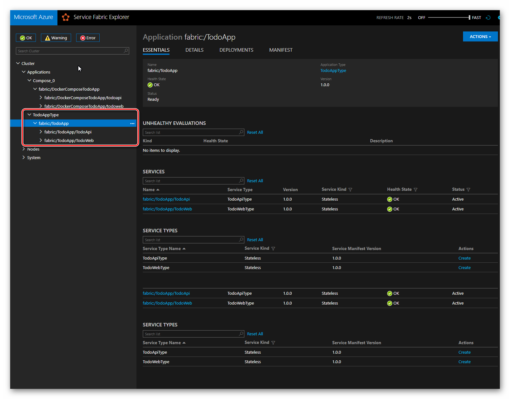 

## Deploy the application to a Linux cluster: parameters stored in Azure Key Vault ##
The **TodoAppFromDockerHub** project shows how to safely deploy a multi-container application to an **Azure Service Fabric Linux** cluster in a production environment. As a security best practice, you should never store sensitive configuration data in the application manifest, service manifest or application parameters file of a Service Fabric application. Unauthorized users could steal this data from the source code repository. This project makes use of a single **Azure Key Vault** repository for storing secrets. Key Vault is a cloud-hosted service for managing cryptographic keys and other secrets. On larger projects, you should use multiple vaults for different environments (development & test, quality assurance, performance testing, production) and grant permissions to these resources only to a restricted set of authorized developers and operators. This project requires that the following sensitive data are stored in **Azure Key Vault**:

- The endpoint URI of the **Cosmos DB** used by the backend service to store data.
- The **Cosmos DB** primary key.
- The name of the **Cosmos DB** database.
- The name of the **Cosmos DB** collection.
- The connection string of the **Service Bus Messaging** namespace used by the backend service for notifications.
- The connection string of the **Storage Account** used by **ASP.NET Core Data  Protection**.
- The instrumentation key of the **Application Insights** resource used to monitor the multi-container application.

Instead, the following parameters are defined in clear-text in the **Cloud.xml** file:

 - The name of the environment variable which contains the path of the .pem certificate file passed by Service Fabric when it starts the container.
 - The name of the environment variable which contains the path of the .key certificate file passed by Service Fabric when it starts the container.
 - The name of the **Service Bus** queue used by the backend service to send notifications any time an operation is performed on a **Cosmos DB** document.
 - The DNS name of the frontend and backend service.
 - The name of the container used by the two services to store **Data Protection** keys in the storage account.

Looking at the service manifests below, you can observe that both the frontend and backend service read configuration data from environment variables. 

**TodoApi ServiceManifest.xml**
```xml
<?xml version="1.0" encoding="utf-8"?>
<ServiceManifest Name="TodoApiPkg"
                 Version="1.0.0"
                 xmlns="http://schemas.microsoft.com/2011/01/fabric"
                 xmlns:xsd="http://www.w3.org/2001/XMLSchema"
                 xmlns:xsi="http://www.w3.org/2001/XMLSchema-instance">
  <ServiceTypes>
    <!-- This is the name of your ServiceType.
         The UseImplicitHost attribute indicates this is a guest service. -->
    <StatelessServiceType ServiceTypeName="TodoApiType" UseImplicitHost="true" />
  </ServiceTypes>

  <!-- Code package is your service executable. -->
  <CodePackage Name="Code" Version="1.0.0">
    <EntryPoint>
      <!-- Follow this link for more information about deploying Windows containers to Service Fabric: https://aka.ms/sfguestcontainers -->
      <ContainerHost>
        <ImageName>DOCKER_HUB_REPOSITORY/todoapi:v1</ImageName>
      </ContainerHost>
    </EntryPoint>
    <!-- Pass environment variables to your container: -->
    <EnvironmentVariables>
      <EnvironmentVariable Name="ASPNETCORE_ENVIRONMENT" Value=""/>
      <EnvironmentVariable Name="AzureKeyVault__Certificate__CertificateEnvironmentVariable" Value=""/>
      <EnvironmentVariable Name="AzureKeyVault__Certificate__KeyEnvironmentVariable" Value=""/>
      <EnvironmentVariable Name="AzureKeyVault__ClientId" Value=""/>
      <EnvironmentVariable Name="AzureKeyVault__Name" Value=""/>
      <EnvironmentVariable Name="NotificationService__ServiceBus__QueueName" Value=""/>
      <EnvironmentVariable Name="DataProtection__BlobStorage__ContainerName" Value=""/>
    </EnvironmentVariables>
  </CodePackage>

  <!-- Config package is the contents of the Config directoy under PackageRoot that contains an 
       independently-updateable and versioned set of custom configuration settings for your service. -->
  <ConfigPackage Name="Config" Version="1.0.0" />

  <Resources>
    <Endpoints>
      <!-- This endpoint is used by the communication listener to obtain the port on which to 
           listen. Please note that if your service is partitioned, this port is shared with 
           replicas of different partitions that are placed in your code. -->
      <Endpoint Name="TodoApiEndpoint" Port="80" UriScheme="http" Protocol="http"/>
    </Endpoints>
  </Resources>
</ServiceManifest>
```
**TodoWeb ServiceManifest.xml**
```xml
<?xml version="1.0" encoding="utf-8"?>
<ServiceManifest Name="TodoWebPkg"
                 Version="1.0.0"
                 xmlns="http://schemas.microsoft.com/2011/01/fabric"
                 xmlns:xsd="http://www.w3.org/2001/XMLSchema"
                 xmlns:xsi="http://www.w3.org/2001/XMLSchema-instance">
  <ServiceTypes>
    <!-- This is the name of your ServiceType.
         The UseImplicitHost attribute indicates this is a guest service. -->
    <StatelessServiceType ServiceTypeName="TodoWebType" UseImplicitHost="true" />
  </ServiceTypes>

  <!-- Code package is your service executable. -->
  <CodePackage Name="Code" Version="1.0.0">
    <EntryPoint>
      <!-- Follow this link for more information about deploying Windows containers to Service Fabric: https://aka.ms/sfguestcontainers -->
      <ContainerHost>
        <ImageName>DOCKER_HUB_REPOSITORY/todoweb:v1</ImageName>
      </ContainerHost>
    </EntryPoint>
    <!-- Pass environment variables to your container: -->
    <EnvironmentVariables>
      <EnvironmentVariable Name="ASPNETCORE_ENVIRONMENT" Value=""/>
      <EnvironmentVariable Name="AzureKeyVault__Certificate__CertificateEnvironmentVariable" Value=""/>
      <EnvironmentVariable Name="AzureKeyVault__Certificate__KeyEnvironmentVariable" Value=""/>
      <EnvironmentVariable Name="AzureKeyVault__ClientId" Value=""/>
      <EnvironmentVariable Name="AzureKeyVault__Name" Value=""/>
      <EnvironmentVariable Name="TodoApiService__EndpointUri" Value=""/>
      <EnvironmentVariable Name="DataProtection__BlobStorage__ContainerName" Value=""/>
    </EnvironmentVariables>
  </CodePackage>

  <!-- Config package is the contents of the Config directoy under PackageRoot that contains an 
       independently-updateable and versioned set of custom configuration settings for your service. -->
  <ConfigPackage Name="Config" Version="1.0.0" />

  <Resources>
    <Endpoints>
      <!-- This endpoint is used by the communication listener to obtain the port on which to 
           listen. Please note that if your service is partitioned, this port is shared with 
           replicas of different partitions that are placed in your code. -->
      <Endpoint Name="TodoWebEndpoint" Port="8080" UriScheme="http" Protocol="http"/>
    </Endpoints>
  </Resources>
</ServiceManifest>
```
Looking at the application manifest, you can observe that the certificate used by each service needs to be installed in the **Azure Service Fabric Linux** cluster before deploying the application. In fact, the certificate identified by its thumbprint needs to exist in the cluster nodes before Docker containers are created for each service. As an alternative, if the certificate used by the application to authenticate against **Azure Key Vault** is not already installed in the cluster, and you have the certificate in the required form (.pfx format for a Windows cluster, .pem and .key format for a Linux cluster),you can use a data package to pass the certificate to both the frontend and backend service. We'll look at this technique in the next section where we explain how to deploy the application to a **Service Fabric Windows** cluster in Azure. 

**ApplicationManifest.xml**
```xml
<?xml version="1.0" encoding="utf-8"?>
<ApplicationManifest ApplicationTypeName="TodoAppType"
                     ApplicationTypeVersion="1.0.0"
                     xmlns="http://schemas.microsoft.com/2011/01/fabric"
                     xmlns:xsd="http://www.w3.org/2001/XMLSchema"
                     xmlns:xsi="http://www.w3.org/2001/XMLSchema-instance">
  <Parameters>
    <!-- Shared Parameters -->
    <Parameter Name="DockerHub_Username" DefaultValue="" />
    <Parameter Name="DockerHub_Password" DefaultValue="" />
    <Parameter Name="ASPNETCORE_ENVIRONMENT" DefaultValue=""/>
    <Parameter Name="Certificate_Thumbprint" DefaultValue="" />
    <Parameter Name="AzureKeyVault__ClientId" DefaultValue=""/>
    <Parameter Name="AzureKeyVault__Name" DefaultValue=""/>
    <!-- TodoWeb Parameters -->
    <Parameter Name="TodoWeb_InstanceCount" DefaultValue="-1" />
    <Parameter Name="TodoWeb_AzureKeyVault__Certificate__CertificateEnvironmentVariable" DefaultValue=""/>
    <Parameter Name="TodoWeb_AzureKeyVault__Certificate__KeyEnvironmentVariable" DefaultValue=""/>
    <Parameter Name="TodoWeb_TodoApiService__EndpointUri" DefaultValue=""/>
    <Parameter Name="TodoWeb_DataProtection__BlobStorage__ContainerName" DefaultValue=""/>
    <!-- TodoApi Parameters -->
    <Parameter Name="TodoApi_InstanceCount" DefaultValue="-1" />
    <Parameter Name="TodoApi_AzureKeyVault__Certificate__CertificateEnvironmentVariable" DefaultValue=""/>
    <Parameter Name="TodoApi_AzureKeyVault__Certificate__KeyEnvironmentVariable" DefaultValue=""/>
    <Parameter Name="TodoApi_NotificationService__ServiceBus__QueueName" DefaultValue=""/>
    <Parameter Name="TodoApi_DataProtection__BlobStorage__ContainerName" DefaultValue=""/>
  </Parameters>
  <!-- Import the ServiceManifest from the ServicePackage. The ServiceManifestName and ServiceManifestVersion 
       should match the Name and Version attributes of the ServiceManifest element defined in the 
       ServiceManifest.xml file. -->
  <ServiceManifestImport>
    <ServiceManifestRef ServiceManifestName="TodoWebPkg" ServiceManifestVersion="1.0.0" />
    <ConfigOverrides />
    <EnvironmentOverrides CodePackageRef="Code">
      <EnvironmentVariable Name="ASPNETCORE_ENVIRONMENT" Value="[ASPNETCORE_ENVIRONMENT]"/>
      <EnvironmentVariable Name="AzureKeyVault__Certificate__CertificateEnvironmentVariable" Value="[TodoWeb_AzureKeyVault__Certificate__CertificateEnvironmentVariable]"/>
      <EnvironmentVariable Name="AzureKeyVault__Certificate__KeyEnvironmentVariable" Value="[TodoWeb_AzureKeyVault__Certificate__KeyEnvironmentVariable]"/>
      <EnvironmentVariable Name="AzureKeyVault__ClientId" Value="[AzureKeyVault__ClientId]"/>
      <EnvironmentVariable Name="AzureKeyVault__Name" Value="[AzureKeyVault__Name]"/>
      <EnvironmentVariable Name="TodoApiService__EndpointUri" Value="[TodoWeb_TodoApiService__EndpointUri]"/>
      <EnvironmentVariable Name="DataProtection__BlobStorage__ContainerName" Value="[TodoWeb_DataProtection__BlobStorage__ContainerName]"/>
    </EnvironmentOverrides>
    <Policies>
      <ContainerHostPolicies CodePackageRef="Code">
        <RepositoryCredentials AccountName="[DockerHub_Username]" Password="[DockerHub_Password]" PasswordEncrypted="false"/>
        <PortBinding ContainerPort="80" EndpointRef="TodoWebEndpoint" />
        <CertificateRef Name="TodoListCert" X509FindValue="[Certificate_Thumbprint]"/>
      </ContainerHostPolicies>
    </Policies>
  </ServiceManifestImport>
  <ServiceManifestImport>
    <ServiceManifestRef ServiceManifestName="TodoApiPkg" ServiceManifestVersion="1.0.0" />
    <ConfigOverrides />
    <EnvironmentOverrides CodePackageRef="Code">
      <EnvironmentVariable Name="ASPNETCORE_ENVIRONMENT" Value="[ASPNETCORE_ENVIRONMENT]"/>
      <EnvironmentVariable Name="AzureKeyVault__Certificate__CertificateEnvironmentVariable" Value="[TodoApi_AzureKeyVault__Certificate__CertificateEnvironmentVariable]"/>
      <EnvironmentVariable Name="AzureKeyVault__Certificate__KeyEnvironmentVariable" Value="[TodoApi_AzureKeyVault__Certificate__KeyEnvironmentVariable]"/>
      <EnvironmentVariable Name="AzureKeyVault__ClientId" Value="[AzureKeyVault__ClientId]"/>
      <EnvironmentVariable Name="AzureKeyVault__Name" Value="[AzureKeyVault__Name]"/>
      <EnvironmentVariable Name="NotificationService__ServiceBus__QueueName" Value="[TodoApi_NotificationService__ServiceBus__QueueName]"/>
      <EnvironmentVariable Name="DataProtection__BlobStorage__ContainerName" Value="[TodoApi_DataProtection__BlobStorage__ContainerName]"/>
    </EnvironmentOverrides>
    <Policies>
      <ContainerHostPolicies CodePackageRef="Code">
        <RepositoryCredentials AccountName="[DockerHub_Username]" Password="[DockerHub_Password]" PasswordEncrypted="false"/>
        <PortBinding ContainerPort="80" EndpointRef="TodoApiEndpoint" />
        <CertificateRef Name="TodoListCert" X509FindValue="[Certificate_Thumbprint]"/>
      </ContainerHostPolicies>
    </Policies>
  </ServiceManifestImport>
  <DefaultServices>
    <!-- The section below creates instances of service types, when an instance of this 
         application type is created. You can also create one or more instances of service type using the 
         ServiceFabric PowerShell module.
         
         The attribute ServiceTypeName below must match the name defined in the imported ServiceManifest.xml file. -->
    <Service Name="TodoWeb" ServicePackageActivationMode="ExclusiveProcess" ServiceDnsName="todoweb.todoapp">
      <StatelessService ServiceTypeName="TodoWebType" InstanceCount="[TodoWeb_InstanceCount]">
        <SingletonPartition />
      </StatelessService>
    </Service>
    <Service Name="TodoApi" ServicePackageActivationMode="ExclusiveProcess" ServiceDnsName="todoapi.todoapp">
      <StatelessService ServiceTypeName="TodoApiType" InstanceCount="[TodoApi_InstanceCount]">
        <SingletonPartition />
      </StatelessService>
    </Service>
  </DefaultServices>
</ApplicationManifest>
```
**Cloud.xml**
```xml
<?xml version="1.0" encoding="utf-8"?>
<Application Name="fabric:/TodoApp" xmlns="http://schemas.microsoft.com/2011/01/fabric" xmlns:xsd="http://www.w3.org/2001/XMLSchema" xmlns:xsi="http://www.w3.org/2001/XMLSchema-instance">
  <Parameters>
    <!-- Shared Parameters -->
    <Parameter Name="DockerHub_Username" Value="DOCKER_HUB_USERNAME" />
    <Parameter Name="DockerHub_Password" Value="DOCKER_HUB_PASSWORD" />
    <Parameter Name="ASPNETCORE_ENVIRONMENT" Value="Development"/>
    <Parameter Name="Certificate_Thumbprint" Value="CERTIFICATE_THUMBPRINT" />
    <Parameter Name="AzureKeyVault__ClientId" Value="AZURE_AD_APPLICATION_ID"/>
    <Parameter Name="AzureKeyVault__Name" Value="AZURE_KEY_VAULT_NAME"/>
    <!-- TodoWeb Parameters -->
    <Parameter Name="TodoWeb_InstanceCount" Value="-1" />
    <Parameter Name="TodoWeb_AzureKeyVault__Certificate__CertificateEnvironmentVariable" Value="Certificates_TodoWebPkg_Code_TodoListCert_PEM"/>
    <Parameter Name="TodoWeb_AzureKeyVault__Certificate__KeyEnvironmentVariable" Value="Certificates_TodoWebPkg_Code_TodoListCert_PrivateKey"/>
    <Parameter Name="TodoWeb_TodoApiService__EndpointUri" Value="todoapi.todoapp"/>
    <Parameter Name="TodoWeb_DataProtection__BlobStorage__ContainerName" Value="todoweb"/>
    <!-- TodoApi Parameters -->
    <Parameter Name="TodoApi_InstanceCount" Value="-1" />
    <Parameter Name="TodoWeb_AzureKeyVault__Certificate__CertificateEnvironmentVariable" Value="Certificates_TodoWebPkg_Code_TodoListCert_PEM"/>
    <Parameter Name="TodoWeb_AzureKeyVault__Certificate__KeyEnvironmentVariable" Value="Certificates_TodoWebPkg_Code_TodoListCert_PrivateKey"/>
    <Parameter Name="TodoApi_NotificationService__ServiceBus__QueueName" Value="todoapi"/>
    <Parameter Name="TodoApi_DataProtection__BlobStorage__ContainerName" Value="todoapi"/>
  </Parameters>
</Application>
```
**Configuration**

Before deploying the application to your **Azure Service Fabric Linux** cluster, open the **Cloud.xml** file and make the following changes:

- Replace **DOCKER_HUB_USERNAME** with the username of your **Docker Hub** repository.
- Replace **DOCKER_HUB_PASSWORD** with the password of your **Docker Hub** repository.
- Replace **CERTIFICATE_THUMBPRINT** with the thumbprint of the certificate used by the application to authenticate against **Azure Key Vault**.
- Replace **AZURE_AD_APPLICATION_ID** with the **ApplicationId** or the **Azure AD Application** used by the application to authenticate to authenticate against **Azure Key Vault**.
- Replace **AZURE_KEY_VAULT_NAME** with the name of the **Azure Key Vault** which stores sensitive configuration data.
  
Then, open the **ServiceManifest** of both the **TodoApi** and **TodoWeb** services and make the following changes:

 - **DOCKER_HUB_REPOSITORY** with the name of your **Docker Hub** repository. 

 ## Deploy the application to a Windows cluster: parameters stored in Azure Key Vault ##
The **TodoAppForWindowsContainers** project shows how to safely deploy a multi-container application to an **Azure Service Fabric Windows** cluster in a production environment. As mentioned in the previous section, you should never store sensitive configuration data in the application manifest, service manifest or application parameters file of a Service Fabric application. Unauthorized users could steal this data from the source code repository. This project makes use of a single **Azure Key Vault** repository for storing secrets. Key Vault is a cloud-hosted service for managing cryptographic keys and other secrets. On larger projects, you should use multiple vaults for different environments (development & test, quality assurance, performance testing, production) and grant permissions to these resources only to a restricted set of authorized developers and operators. This project requires that the following sensitive data are stored in **Azure Key Vault**:

- The endpoint URI of the **Cosmos DB** used by the backend service to store data.
- The **Cosmos DB** primary key.
- The name of the **Cosmos DB** database.
- The name of the **Cosmos DB** collection.
- The connection string of the **Service Bus Messaging** namespace used by the backend service for notifications.
- The connection string of the **Storage Account** used by **ASP.NET Core Data  Protection**.
- The instrumentation key of the **Application Insights** resource used to monitor the multi-container application.

Instead, the following parameters are defined in clear-text in the **Cloud.xml** file:

 - The name of the environment variable which contains the path of the .pem certificate file passed by Service Fabric when it starts the container.
 - The name of the environment variable which contains the path of the .key certificate file passed by Service Fabric when it starts the container.
 - The name of the **Service Bus** queue used by the backend service to send notifications any time an operation is performed on a **Cosmos DB** document.
 - The DNS name of the frontend and backend service.
 - The name of the container used by the two services to store **Data Protection** keys in the storage account.

Looking at the service manifests below, you can observe that both the frontend and backend service read configuration data from environment variables, while the certificate used to authenticate against **Azure Key Vault** is contained in data package called **Data**. 

**Note**: Docker containers offer isolation not virtualization. The operating system of the host machine and container image must be the same. You cannot use a Linux container on a Windows machine or a Windows container on a Linux machine. As a consequence, you cannot use a Docker image for Linux to deploy a Window container to a **Service Fabric Windows** cluster in Azure. Likewise, you cannot use a Docker image for Windows to deploy a Linux container  to a **Service Fabric Linux** cluster in Azure. Hence, you need to build OS-specific images to deploy the multi-container application to a Service Fabric Windows or Linux cluster in Azure.

**TodoApi ServiceManifest.xml**
```xml
<?xml version="1.0" encoding="utf-8"?>
<ServiceManifest Name="TodoApiPkg"
                 Version="1.0.0"
                 xmlns="http://schemas.microsoft.com/2011/01/fabric"
                 xmlns:xsd="http://www.w3.org/2001/XMLSchema"
                 xmlns:xsi="http://www.w3.org/2001/XMLSchema-instance">
  <ServiceTypes>
    <!-- This is the name of your ServiceType.
         The UseImplicitHost attribute indicates this is a guest service. -->
    <StatelessServiceType ServiceTypeName="TodoApiType" UseImplicitHost="true" />
  </ServiceTypes>

  <!-- Code package is your service executable. -->
  <CodePackage Name="Code" Version="1.0.0">
    <EntryPoint>
      <!-- Follow this link for more information about deploying Windows containers to Service Fabric: https://aka.ms/sfguestcontainers -->
      <ContainerHost>
        <ImageName>DOCKER_HUB_REPOSITORY/wintodoapi:v1</ImageName>
      </ContainerHost>
    </EntryPoint>
    <!-- Pass environment variables to your container: -->
    <EnvironmentVariables>
      <EnvironmentVariable Name="ASPNETCORE_ENVIRONMENT" Value=""/>
      <EnvironmentVariable Name="AzureKeyVault__Certificate__CertificateEnvironmentVariable" Value=""/>
      <EnvironmentVariable Name="AzureKeyVault__Certificate__KeyEnvironmentVariable" Value=""/>
      <EnvironmentVariable Name="AzureKeyVault__ClientId" Value=""/>
      <EnvironmentVariable Name="AzureKeyVault__Name" Value=""/>
      <EnvironmentVariable Name="NotificationService__ServiceBus__QueueName" Value=""/>
      <EnvironmentVariable Name="DataProtection__BlobStorage__ContainerName" Value=""/>
    </EnvironmentVariables>
  </CodePackage>

  <!-- Config package is the contents of the Config directoy under PackageRoot that contains an 
       independently-updateable and versioned set of custom configuration settings for your service. -->
  <ConfigPackage Name="Config" Version="1.0.0" />

  <!-- Data Package defines the name of a folder which contains data files, in this case the certificate
       used by the container to authenticate against Key Vault -->
  <DataPackage Name="Data" Version="1.0.0"/>

  <Resources>
    <Endpoints>
      <!-- This endpoint is used by the communication listener to obtain the port on which to 
           listen. Please note that if your service is partitioned, this port is shared with 
           replicas of different partitions that are placed in your code. -->
      <Endpoint Name="TodoApiEndpoint" Port="80" UriScheme="http" Protocol="http"/>
    </Endpoints>
  </Resources>
</ServiceManifest>
```
**TodoWeb ServiceManifest.xml**
```xml
<?xml version="1.0" encoding="utf-8"?>
<ServiceManifest Name="TodoWebPkg"
                 Version="1.0.0"
                 xmlns="http://schemas.microsoft.com/2011/01/fabric"
                 xmlns:xsd="http://www.w3.org/2001/XMLSchema"
                 xmlns:xsi="http://www.w3.org/2001/XMLSchema-instance">
  <ServiceTypes>
    <!-- This is the name of your ServiceType.
         The UseImplicitHost attribute indicates this is a guest service. -->
    <StatelessServiceType ServiceTypeName="TodoWebType" UseImplicitHost="true" />
  </ServiceTypes>

  <!-- Code package is your service executable. -->
  <CodePackage Name="Code" Version="1.0.0">
    <EntryPoint>
      <!-- Follow this link for more information about deploying Windows containers to Service Fabric: https://aka.ms/sfguestcontainers -->
      <ContainerHost>
        <ImageName>DOCKER_HUB_REPOSITORY/wintodoweb:v1</ImageName>
      </ContainerHost>
    </EntryPoint>
    <!-- Pass environment variables to your container: -->
    <EnvironmentVariables>
      <EnvironmentVariable Name="ASPNETCORE_ENVIRONMENT" Value=""/>
      <EnvironmentVariable Name="AzureKeyVault__Certificate__CertificateEnvironmentVariable" Value=""/>
      <EnvironmentVariable Name="AzureKeyVault__Certificate__KeyEnvironmentVariable" Value=""/>
      <EnvironmentVariable Name="AzureKeyVault__ClientId" Value=""/>
      <EnvironmentVariable Name="AzureKeyVault__Name" Value=""/>
      <EnvironmentVariable Name="TodoApiService__EndpointUri" Value=""/>
      <EnvironmentVariable Name="DataProtection__BlobStorage__ContainerName" Value=""/>
    </EnvironmentVariables>
  </CodePackage>

  <!-- Config package is the contents of the Config directoy under PackageRoot that contains an 
       independently-updateable and versioned set of custom configuration settings for your service. -->
  <ConfigPackage Name="Config" Version="1.0.0" />

  <!-- Data Package defines the name of a folder which contains data files, in this case the certificate
  used by the container to authenticate against Key Vault -->
  <DataPackage Name="Data" Version="1.0.0"/>

  <Resources>
    <Endpoints>
      <!-- This endpoint is used by the communication listener to obtain the port on which to 
           listen. Please note that if your service is partitioned, this port is shared with 
           replicas of different partitions that are placed in your code. -->
      <Endpoint Name="TodoWebEndpoint" Port="8080" UriScheme="http" Protocol="http"/>
    </Endpoints>
  </Resources>
</ServiceManifest>
```
Looking at the application manifest, you can observe the certificate used by the frontend and backend services to authenticate against **Azure Key Vault** is defined in a data package.

**ApplicationManifest.xml**
```xml
<?xml version="1.0" encoding="utf-8"?>
<ApplicationManifest ApplicationTypeName="TodoAppType"
                     ApplicationTypeVersion="1.0.0"
                     xmlns="http://schemas.microsoft.com/2011/01/fabric"
                     xmlns:xsd="http://www.w3.org/2001/XMLSchema"
                     xmlns:xsi="http://www.w3.org/2001/XMLSchema-instance">
  <Parameters>
    <!-- Shared Parameters -->
    <Parameter Name="DockerHub_Username" DefaultValue="" />
    <Parameter Name="DockerHub_Password" DefaultValue="" />
    <Parameter Name="ASPNETCORE_ENVIRONMENT" DefaultValue=""/>
    <Parameter Name="Certificate_Thumbprint" DefaultValue="" />
    <Parameter Name="AzureKeyVault__ClientId" DefaultValue=""/>
    <Parameter Name="AzureKeyVault__Name" DefaultValue=""/>
    <!-- TodoWeb Parameters -->
    <Parameter Name="TodoWeb_InstanceCount" DefaultValue="-1" />
    <Parameter Name="TodoWeb_AzureKeyVault__Certificate__CertificateEnvironmentVariable" DefaultValue=""/>
    <Parameter Name="TodoWeb_AzureKeyVault__Certificate__KeyEnvironmentVariable" DefaultValue=""/>
    <Parameter Name="TodoWeb_TodoApiService__EndpointUri" DefaultValue=""/>
    <Parameter Name="TodoWeb_DataProtection__BlobStorage__ContainerName" DefaultValue=""/>
    <!-- TodoApi Parameters -->
    <Parameter Name="TodoApi_InstanceCount" DefaultValue="-1" />
    <Parameter Name="TodoApi_AzureKeyVault__Certificate__CertificateEnvironmentVariable" DefaultValue=""/>
    <Parameter Name="TodoApi_AzureKeyVault__Certificate__KeyEnvironmentVariable" DefaultValue=""/>
    <Parameter Name="TodoApi_NotificationService__ServiceBus__QueueName" DefaultValue=""/>
    <Parameter Name="TodoApi_DataProtection__BlobStorage__ContainerName" DefaultValue=""/>
  </Parameters>
  <!-- Import the ServiceManifest from the ServicePackage. The ServiceManifestName and ServiceManifestVersion 
       should match the Name and Version attributes of the ServiceManifest element defined in the 
       ServiceManifest.xml file. -->
  <ServiceManifestImport>
    <ServiceManifestRef ServiceManifestName="TodoWebPkg" ServiceManifestVersion="1.0.0" />
    <ConfigOverrides />
    <EnvironmentOverrides CodePackageRef="Code">
      <EnvironmentVariable Name="ASPNETCORE_ENVIRONMENT" Value="[ASPNETCORE_ENVIRONMENT]"/>
      <EnvironmentVariable Name="AzureKeyVault__Certificate__CertificateEnvironmentVariable" Value="[TodoWeb_AzureKeyVault__Certificate__CertificateEnvironmentVariable]"/>
      <EnvironmentVariable Name="AzureKeyVault__Certificate__KeyEnvironmentVariable" Value="[TodoWeb_AzureKeyVault__Certificate__KeyEnvironmentVariable]"/>
      <EnvironmentVariable Name="AzureKeyVault__ClientId" Value="[AzureKeyVault__ClientId]"/>
      <EnvironmentVariable Name="AzureKeyVault__Name" Value="[AzureKeyVault__Name]"/>
      <EnvironmentVariable Name="TodoApiService__EndpointUri" Value="[TodoWeb_TodoApiService__EndpointUri]"/>
      <EnvironmentVariable Name="DataProtection__BlobStorage__ContainerName" Value="[TodoWeb_DataProtection__BlobStorage__ContainerName]"/>
    </EnvironmentOverrides>
    <Policies>
      <ContainerHostPolicies CodePackageRef="Code">
        <RepositoryCredentials AccountName="[DockerHub_Username]" Password="[DockerHub_Password]" PasswordEncrypted="false"/>
        <PortBinding ContainerPort="80" EndpointRef="TodoWebEndpoint" />
        <CertificateRef Name="TodoListCert" X509FindValue="[Certificate_Thumbprint]"/>
      </ContainerHostPolicies>
    </Policies>
  </ServiceManifestImport>
  <ServiceManifestImport>
    <ServiceManifestRef ServiceManifestName="TodoApiPkg" ServiceManifestVersion="1.0.0" />
    <ConfigOverrides />
    <EnvironmentOverrides CodePackageRef="Code">
      <EnvironmentVariable Name="ASPNETCORE_ENVIRONMENT" Value="[ASPNETCORE_ENVIRONMENT]"/>
      <EnvironmentVariable Name="AzureKeyVault__Certificate__CertificateEnvironmentVariable" Value="[TodoApi_AzureKeyVault__Certificate__CertificateEnvironmentVariable]"/>
      <EnvironmentVariable Name="AzureKeyVault__Certificate__KeyEnvironmentVariable" Value="[TodoApi_AzureKeyVault__Certificate__KeyEnvironmentVariable]"/>
      <EnvironmentVariable Name="AzureKeyVault__ClientId" Value="[AzureKeyVault__ClientId]"/>
      <EnvironmentVariable Name="AzureKeyVault__Name" Value="[AzureKeyVault__Name]"/>
      <EnvironmentVariable Name="NotificationService__ServiceBus__QueueName" Value="[TodoApi_NotificationService__ServiceBus__QueueName]"/>
      <EnvironmentVariable Name="DataProtection__BlobStorage__ContainerName" Value="[TodoApi_DataProtection__BlobStorage__ContainerName]"/>
    </EnvironmentOverrides>
    <Policies>
      <ContainerHostPolicies CodePackageRef="Code">
        <RepositoryCredentials AccountName="[DockerHub_Username]" Password="[DockerHub_Password]" PasswordEncrypted="false"/>
        <PortBinding ContainerPort="80" EndpointRef="TodoApiEndpoint" />
        <CertificateRef Name="TodoListCert" X509FindValue="[Certificate_Thumbprint]"/>
      </ContainerHostPolicies>
    </Policies>
  </ServiceManifestImport>
  <DefaultServices>
    <!-- The section below creates instances of service types, when an instance of this 
         application type is created. You can also create one or more instances of service type using the 
         ServiceFabric PowerShell module.
         
         The attribute ServiceTypeName below must match the name defined in the imported ServiceManifest.xml file. -->
    <Service Name="TodoWeb" ServicePackageActivationMode="ExclusiveProcess" ServiceDnsName="todoweb.todoapp">
      <StatelessService ServiceTypeName="TodoWebType" InstanceCount="[TodoWeb_InstanceCount]">
        <SingletonPartition />
      </StatelessService>
    </Service>
    <Service Name="TodoApi" ServicePackageActivationMode="ExclusiveProcess" ServiceDnsName="todoapi.todoapp">
      <StatelessService ServiceTypeName="TodoApiType" InstanceCount="[TodoApi_InstanceCount]">
        <SingletonPartition />
      </StatelessService>
    </Service>
  </DefaultServices>
</ApplicationManifest>
```
**Cloud.xml**
```xml
<?xml version="1.0" encoding="utf-8"?>
<Application Name="fabric:/TodoApp" xmlns="http://schemas.microsoft.com/2011/01/fabric" xmlns:xsd="http://www.w3.org/2001/XMLSchema" xmlns:xsi="http://www.w3.org/2001/XMLSchema-instance">
  <Parameters>
    <!-- Shared Parameters -->
    <Parameter Name="DockerHub_Username" Value="DOCKER_HUB_USERNAME" />
    <Parameter Name="DockerHub_Password" Value="DOCKER_HUB_PASSWORD" />
    <Parameter Name="ASPNETCORE_ENVIRONMENT" Value="Development"/>
    <Parameter Name="AzureKeyVault__ClientId" Value="AZURE_AD_APPLICATION_ID"/>
    <Parameter Name="AzureKeyVault__Name" Value="AZURE_KEY_VAULT_NAME"/>
    <!-- TodoWeb Parameters -->
    <Parameter Name="TodoWeb_InstanceCount" Value="-1" />
    <Parameter Name="TodoWeb_AzureKeyVault__Certificate__CertificateEnvironmentVariable" Value="Certificates_TodoWebPkg_Code_TodoListCert_PEM"/>
    <Parameter Name="TodoWeb_AzureKeyVault__Certificate__KeyEnvironmentVariable" Value="Certificates_TodoWebPkg_Code_TodoListCert_PrivateKey"/>
    <Parameter Name="TodoWeb_TodoApiService__EndpointUri" Value="todoapi.todoapp"/>
    <Parameter Name="TodoWeb_DataProtection__BlobStorage__ContainerName" Value="todoweb"/>
    <!-- TodoApi Parameters -->
    <Parameter Name="TodoApi_InstanceCount" Value="-1" />
    <Parameter Name="TodoWeb_AzureKeyVault__Certificate__CertificateEnvironmentVariable" Value="Certificates_TodoWebPkg_Code_TodoListCert_PEM"/>
    <Parameter Name="TodoWeb_AzureKeyVault__Certificate__KeyEnvironmentVariable" Value="Certificates_TodoWebPkg_Code_TodoListCert_PrivateKey"/>
    <Parameter Name="TodoApi_NotificationService__ServiceBus__QueueName" Value="todoapi"/>
    <Parameter Name="TodoApi_DataProtection__BlobStorage__ContainerName" Value="todoapi"/>
  </Parameters>
</Application>
```
**Configuration**

Before deploying the application to your **Azure Service Fabric Linux** cluster, open the **Cloud.xml** file and make the following changes:

- Replace **DOCKER_HUB_USERNAME** with the username of your **Docker Hub** repository.
- Replace **DOCKER_HUB_PASSWORD** with the password of your **Docker Hub** repository.
- Replace **AZURE_AD_APPLICATION_ID** with the **ApplicationId** or the **Azure AD Application** used by the application to authenticate to authenticate against **Azure Key Vault**.
- Replace **AZURE_KEY_VAULT_NAME** with the name of the **Azure Key Vault** which stores sensitive configuration data.
  
Then, open the **ServiceManifest** of both the **TodoApi** and **TodoWeb** services and make the following changes:

 - **DOCKER_HUB_REPOSITORY** with the name of your **Docker Hub** repository. 

# Service Fabric Deployment with Docker Compose #  
**Docker** uses the **docker-compose.yml** file for defining multi-container applications. To make it easy for developers familiar with **Docker** to orchestrate existing container applications on **Service Fabric**, now you can use **docker compose** to deploy your multi-container application to a **Service Fabric** cluster in Azure. For more information, see [Docker Compose deployment support in Azure Service Fabric](https://docs.microsoft.com/en-us/azure/service-fabric/service-fabric-docker-compose).

**Note 1**: this project allows you to specify secret parameters in clear-text in the .yaml file only for testing purposes without the need to store them in **Azure Key Vault**. We highly discourage to use this approach in a production environment and we strongly recommend you to store sensitive configuration data in **Azure Key Vault**.

**Note 2**: Service Fabric can accept version 3 and later of docker-compose.yml files.

Below you can see the batch script and PowerShell script used to deploy the multi-container application to a **Service Fabric Linux cluster in Azure with DNS Service**. You can pull **Docker** images from an **Azure Container Registry** or from a **Docker Hub** repository.

## Pull images from Azure Container Service ##
To deploy the multi-container application pulling the **Docker** images from an **Azure Container Registry** you can use one of the following scripts:

- **servicefabric-create-deployment-from-azure-container-registry.cmd**: this batch script uses the [Azure Service Fabric CLI](https://docs.microsoft.com/en-us/azure/service-fabric/service-fabric-cli) to deploy the **DockerComposeTodoApp** multi-container application to an **Azure Service Fabric Linux** cluster using [Docker Compose](https://docs.docker.com/compose/) and pulling the **Docker** images from an **Azure Container Registry** using the definition for the **todoweb** and **todoapi** services contained in the **servicefabric-docker-compose-from-azure-container-registry.yml** file.. For more information, see [Docker Compose deployment support in Azure Service Fabric](https://docs.microsoft.com/en-us/azure/service-fabric/service-fabric-docker-compose).

- **servicefabric-create-deployment-from-azure-container-registry.ps1**: this PowerShell script is used to deploy the **DockerComposeTodoApp** multi-container application to an **Azure Service Fabric Linux** cluster using [Docker Compose](https://docs.docker.com/compose/) and pulling the **Docker** images from an **Azure Container Registry** using the definition for the **todoweb** and **todoapi** services contained in the **servicefabric-docker-compose-from-azure-container-registry.yml** file.. For more information, see [Docker Compose deployment support in Azure Service Fabric](https://docs.microsoft.com/en-us/azure/service-fabric/service-fabric-docker-compose).

**servicefabric-docker-compose-from-azure-container-registry.yml**
```yaml
version: '3'

services:
  todoapi:
    image:AZURE_CONTAINER_REGISTRY_NAME.azurecr.io/todoapi:latest
    deploy:
      mode: replicated
      replicas: 5
    environment:
      - ASPNETCORE_ENVIRONMENT=Development
      - RepositoryService__CosmosDb__EndpointUri=COSMOS_DB_ENDPOINT_URI
      - RepositoryService__CosmosDb__PrimaryKey=COSMOS_DB_PRIMARY_KEY
      - RepositoryService__CosmosDb__DatabaseName=TodoApiDb
      - RepositoryService__CosmosDb__CollectionName=TodoApiCollection
      - DataProtection__BlobStorage__ConnectionString=STORAGE_ACCOUNT_CONNECTION_STRING
      - DataProtection__BlobStorage__ContainerName=todoapi
      - NotificationService__ServiceBus__ConnectionString=SERVICE_BUS_CONNECTION_STRING
      - NotificationService__ServiceBus__QueueName=todoapi
      - ApplicationInsights__InstrumentationKey=APPLICATION_INSIGHTS_INSTRUMENTATION_KEY
    ports:
      - "8081:80"

  todoweb:
    image:AZURE_CONTAINER_REGISTRY_NAME.azurecr.io/todoweb:latest
    deploy:
      mode: replicated
      replicas: 5
    environment:
      - ASPNETCORE_ENVIRONMENT=Development
      - TodoApiService__EndpointUri=todoapi.todoapp:8081
      - DataProtection__BlobStorage__ConnectionString=STORAGE_ACCOUNT_CONNECTION_STRING
      - DataProtection__BlobStorage__ContainerName=todoweb
      - ApplicationInsights__InstrumentationKey=APPLICATION_INSIGHTS_INSTRUMENTATION_KEY
    ports:
      - "8082:80"
```

**servicefabric-create-deployment-from-azure-container-registry.cmd**
```batchfile
REM Create a Service Fabric Compose deployment from a docker-compose.yml file
sfctl compose create --name DockerComposeTodoApp --file-path servicefabric-docker-compose-from-azure-container-registry.yml --user AZURE_CONTAINER_REGISTRY_USERNAME --encrypted-pass AZURE_CONTAINER_REGISTRY_PASSWORD
```
**servicefabric-create-deployment-from-azure-container-registry.ps1**
```PowerShell
# Copy the package and register application type of version 1.0
$connectionEndpoint = "SERVICE_FABRIC_NAME.SERVICE_FABRIC_LOCATION.cloudapp.azure.com:19000"
$dockerComposeFile = $PSScriptRoot + '\servicefabric-docker-compose-from-azure-container-registry.yml'


Connect-ServiceFabricCluster -ConnectionEndpoint $connectionEndpoint 

New-ServiceFabricComposeDeployment -DeploymentName DockerComposeTodoApp -Compose $dockerComposeFile -RegistryUserName AZURE_CONTAINER_REGISTRY_USERNAME -RegistryPassword AZURE_CONTAINER_REGISTRY_PASSWORD
```
**Configuration**

Before deploying the application to your **Azure Service Fabric Linux** cluster, open the batch and PowerShell scripts and make the following changes:

- Replace **AZURE_CONTAINER_REGISTRY_USERNAME**  with your **AZURE_CONTAINER_REGISTRY** username. **Note**: the username is case sensitive.
- Replace **AZURE_CONTAINER_REGISTRY_PASSWORD** with your **AZURE_CONTAINER_REGISTRY** password.
- Replace **SERVICE_FABRIC_NAME** in the PowerShell script with the name of your **Azure Service Fabric Linux** cluster.
- Replace **SERVICE_FABRIC_LOCATION** in the PowerShell script with the location of your **Azure Service Fabric Linux** cluster.

Then, open the YAML file and make the following changes:

- Replace **AZURE_CONTAINER_REGISTRY_NAME** with the name of your **Azure Container Registry** in the YAML file.
- Replace **COSMOS_DB_ENDPOINT_URI** with the endpoint URI of your **Cosmos DB**.
- Replace **COSMOS_DB_PRIMARY_KEY** with the primary key of your **Cosmos DB**.
- Replace **SERVICE_BUS_CONNECTION_STRING** with the connection string of your **Service Bus Messaging** namespace.
- Replace **STORAGE_ACCOUNT_CONNECTION_STRING** with the connection string of the **Storage Account** used by **ASP.NET Core Data  Protection**
- **APPLICATION_INSIGHTS_INSTRUMENTATION_KEY** with the instrumentation key of the **Application Insights** resource used to monitor the multi-container application.

You can retrieve the usename and password of your **Azure Container Registry** by running folloring command:

```Batchfile
az acr credential show -n AZURE_CONTAINER_REGISTRY
```
as shown in the following picture:

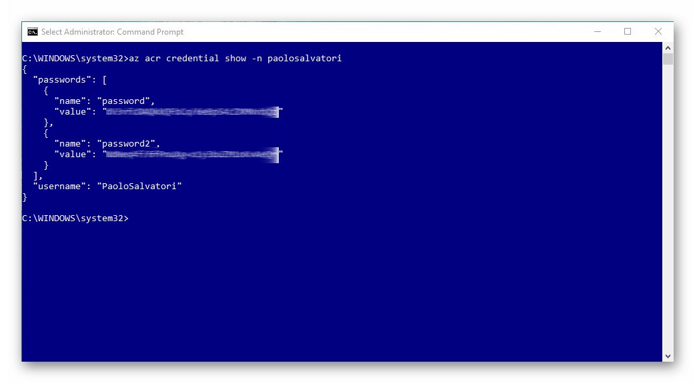

## Pull images from Docker Hub ##
To deploy the multi-container application pulling the **Docker** images from an **Docker Hub** you can use the following scripts:

- **servicefabric-create-deployment-from-docker-hub.cmd**: this batch script uses the [Azure Service Fabric CLI](https://docs.microsoft.com/en-us/azure/service-fabric/service-fabric-cli) to deploy the **DockerComposeTodoApp** multi-container application to an **Azure Service Fabric Linux** cluster using [Docker Compose](https://docs.docker.com/compose/) and pulling the **Docker** images from a **Docker Hub** repository using the definition for the **todoweb** and **todoapi** services contained in the **servicefabric-docker-compose-from-docker-hub.yml** file.. For more information, see [Docker Compose deployment support in Azure Service Fabric](https://docs.microsoft.com/en-us/azure/service-fabric/service-fabric-docker-compose).

- **servicefabric-create-deployment-from-docker-hub.ps1**: this PowerShell script is used to deploy the **DockerComposeTodoApp** multi-container application to an **Azure Service Fabric Linux** cluster using [Docker Compose](https://docs.docker.com/compose/) and pulling the **Docker** images from a **Docker Hub** repository using the definition for the **todoweb** and **todoapi** services contained in the **servicefabric-docker-compose-from-docker-hub.yml** file.. For more information, see [Docker Compose deployment support in Azure Service Fabric](https://docs.microsoft.com/en-us/azure/service-fabric/service-fabric-docker-compose).

**servicefabric-docker-compose-from-docker-hub.yml**
```yaml
version: '3'

services:
  todoapi:
    image: DOCKER_HUB_REPOSITORY/todoapi:latest
    deploy:
      mode: replicated
      replicas: 5
    environment:
      - ASPNETCORE_ENVIRONMENT=Development
      - RepositoryService__CosmosDb__EndpointUri=COSMOS_DB_ENDPOINT_URI
      - RepositoryService__CosmosDb__PrimaryKey=COSMOS_DB_PRIMARY_KEY
      - RepositoryService__CosmosDb__DatabaseName=TodoApiDb
      - RepositoryService__CosmosDb__CollectionName=TodoApiCollection
      - DataProtection__BlobStorage__ConnectionString=STORAGE_ACCOUNT_CONNECTION_STRING
      - DataProtection__BlobStorage__ContainerName=todoapi
      - NotificationService__ServiceBus__ConnectionString=SERVICE_BUS_CONNECTION_STRING
      - NotificationService__ServiceBus__QueueName=todoapi
      - ApplicationInsights__InstrumentationKey=APPLICATION_INSIGHTS_INSTRUMENTATION_KEY
    ports:
      - "8081:80"

  todoweb:
    image: DOCKER_HUB_REPOSITORY/todoweb:latest
    deploy:
      mode: replicated
      replicas: 5
    environment:
      - ASPNETCORE_ENVIRONMENT=Development
      - TodoApiService__EndpointUri=todoapi.todoapp:8081
      - DataProtection__BlobStorage__ConnectionString=STORAGE_ACCOUNT_CONNECTION_STRING
      - DataProtection__BlobStorage__ContainerName=todoweb
      - ApplicationInsights__InstrumentationKey=APPLICATION_INSIGHTS_INSTRUMENTATION_KEY
    ports:
      - "8082:80"
```

**servicefabric-create-deployment-from-docker-hub.cmd**
```batchfile
REM Create a Service Fabric Compose deployment from a docker-compose.yml file
sfctl compose create --name DockerComposeTodoApp --file-path servicefabric-docker-compose-from-docker-hub.yml --user DOCKER_HUB_USERNAME --encrypted-pass DOCKER_HUB_PASSWORD
```
**servicefabric-create-deployment-from-docker-hub.ps1**
```PowerShell
# Copy the package and register application type of version 1.0
$connectionEndpoint = "SERVICE_FABRIC_NAME.SERVICE_FABRIC_LOCATION.cloudapp.azure.com:19000"
$dockerComposeFile = $PSScriptRoot + '\servicefabric-docker-compose-from-docker-hub.yml'


Connect-ServiceFabricCluster -ConnectionEndpoint $connectionEndpoint 

New-ServiceFabricComposeDeployment -DeploymentName DockerComposeTodoApp -Compose $dockerComposeFile -RegistryUserName DOCKER_HUB_USERNAME -RegistryPassword DOCKER_HUB_PASSWORD
```
**Configuration**

Before deploying the application to your **Azure Service Fabric Linux** cluster, open the batch scripts and PowerShell scripts and make the following changes:

- Replace **DOCKER-HUB-USERNAME** with your **Docker Hub** username.
- Replace **DOCKER_HUB_PASSWORD** with your **Docker Hub** password.
- Replace **SERVICE_FABRIC_NAME** in the PowerShell script with the name of your **Azure Service Fabric Linux** cluster.
- Replace **SERVICE_FABRIC_LOCATION** in the PowerShell script with the location of your **Azure Service Fabric Linux** cluster.

The open the YAML file and make the following changes:

- Replace **DOCKER_HUB_REPOSITORY** with the name of your **Docker Hub** repository.
- Replace **COSMOS_DB_ENDPOINT_URI** with the endpoint URI of your **Cosmos DB**.
- Replace **COSMOS_DB_PRIMARY_KEY** with the primary key of your **Cosmos DB**.
- Replace **SERVICE_BUS_CONNECTION_STRING**: this placeholder with the connection string of your **Service Bus Messaging** namespace.
- Replace **STORAGE_ACCOUNT_CONNECTION_STRING** with the connection string of the **Storage Account** used by **ASP.NET Core Data  Protection**
- Replace **APPLICATION_INSIGHTS_INSTRUMENTATION_KEY** with the instrumentation key of the **Application Insights** resource used to monitor the multi-container application.

### Observations ###
- Both the **todoapi** and **todoweb** containerized services are defined as stateless services.
- The **ApplicationManifest.xml** defines a **ServiceDnsName="todoapi.todoapp"** for the **todoapi** service. This **DNS** name and port used by the **todoapi** backend service are passed as value to the **TodoApiService__EndpointUri** (e.g. todoapi.todoapp:8081) environment variable and the value of the environment variable is used by the **todoweb** frontend service to create the http address of the  **todoapi** backend service.
- The instance count for both services is equal to -1. This means that a container for each service is created on each **Service Fabric** cluster node.

The following picture shows the multi-container application using the **Service Fabric Explorer**.

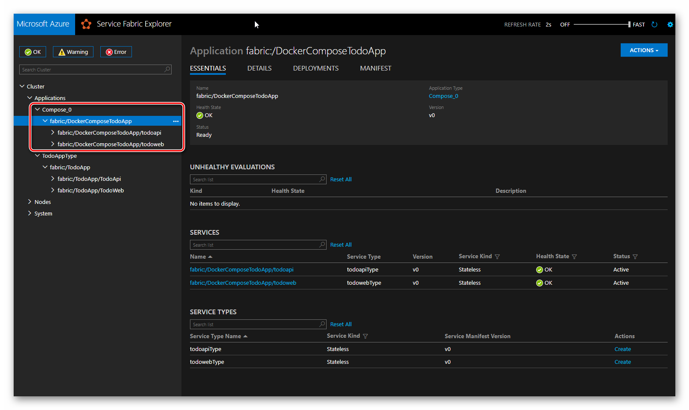 

# Deploy the multi-container on an Azure Container Service Kubernetes Cluster #
First of all, you have to create an **Azure Container Service Kubernetes cluster**. At this regard, you can use one of the following options:

- **ACS**: this approach relies on an **Azure Container Service** with **Kubernetes** as container orchestrator. For more information, see [Azure Container Service with Kubernetes](https://docs.microsoft.com/en-us/azure/container-service/kubernetes/).
- **AKS**: this approach uses the new managed **Kubernetes** service running on [Azure Container Service](https://azure.microsoft.com/en-us/services/container-service/). This new service features an Azure-hosted control plane, automated upgrades, self-healing, easy scaling, and a simple user experience for both developers and cluster operators. For more information, see:

  - [Introducing AKS (managed Kubernetes) and Azure Container Registry improvements]https://azure.microsoft.com/it-it/blog/introducing-azure-container-service-aks-managed-kubernetes-and-azure-container-registry-geo-replication/).
  -	[Introduction to Azure Container Service (AKS)](https://docs.microsoft.com/en-us/azure/aks/intro-kubernetes).

## Create an ACS cluster ##
You can create an **Azure Container Service Kubernetes** cluster using the [Azure CLI](https://azure.github.io/projects/clis/) and then use the [kubectl](https://kubernetes.io/docs/user-guide/kubectl-overview/) command line interface to run commands against the **Kubernetes** cluster in Azure. For more information, see [Deploy a Kubernetes cluster in Azure Container Service](https://docs.microsoft.com/en-us/azure/container-service/kubernetes/container-service-tutorial-kubernetes-deploy-cluster). 

The following batch script shows how you can create an **Azure Container Service Kubernetes** cluster.

**create-kubernetes-acs-cluster.cmd**
```Batchfile
REM Create a resource group for Kubernetes
az group create --name AcsKubernetesResourceGroup --location WestEurope --tags orchestrator=kubernetes

REM Create a Kubernetes cluster using ACS
az acs create --orchestrator-type kubernetes --name AcsKubernetes --resource-group AcsKubernetesResourceGroup --generate-ssh-keys --output jsonc

REM Install kubectl on the local machine
az acs kubernetes install-cli

REM Get credentials to connect to Kubernetes cluster using kubectl
az acs kubernetes get-credentials --name AcsKubernetes --resource-group AcsKubernetesResourceGroup 

REM Browse to Kubernetes Web UI
az acs kubernetes browse --name AcsKubernetes --resource-group AcsKubernetesResourceGroup
```
The last command launches the Kubernetes web UI that allows to manage all the Kubernetes entities (services, pods, deployments, etc.).

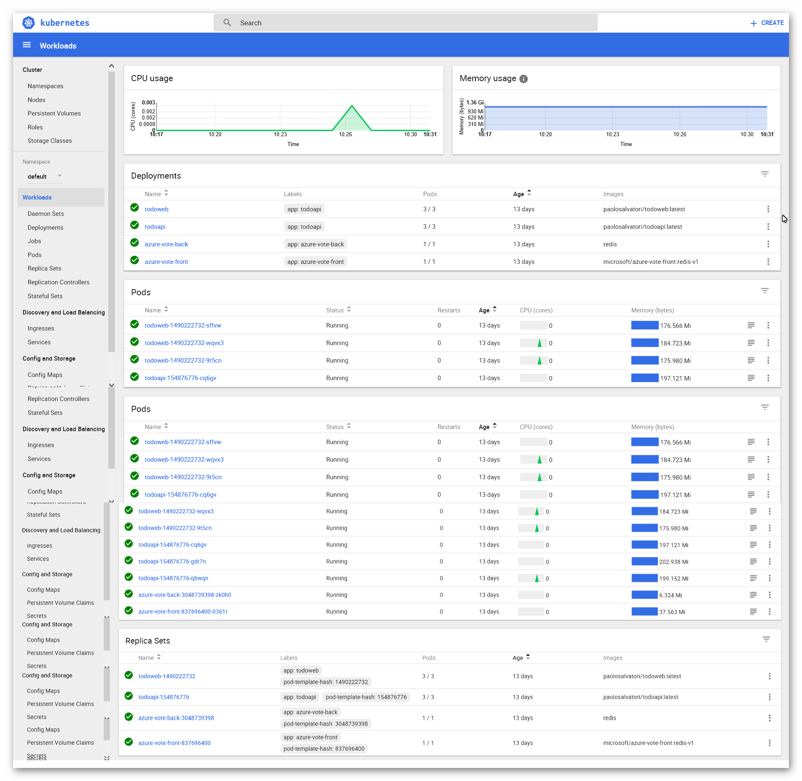 

## Create an AKS cluster ##
You can create a managed **Kubernetes** service using the [Azure CLI](https://azure.github.io/projects/clis/) and then use the [kubectl](https://kubernetes.io/docs/user-guide/kubectl-overview/) command line interface to run commands against the **Kubernetes** cluster in Azure. For more information, see [Deploy an Azure Container Service (AKS) cluster](https://docs.microsoft.com/en-us/azure/aks/kubernetes-walkthrough).

The following batch script shows how you can create an **Azure Container Service Kubernetes** cluster.

**create-kubernetes-aks-cluster.cmd**
```Batchfile
REM Create a resource group for Kubernetes
az group create --name AksKubernetesResourceGroup --location westus2 --output jsonc

REM Create a Kubernetes cluster using ACS
az aks create --resource-group AksKubernetesResourceGroup --name AksKubernetes --agent-count 3 --generate-ssh-keys --output jsonc

REM Install kubectl on the local machine
az aks install-cli

REM Get credentials to connect to Kubernetes cluster using kubectl
az aks get-credentials --name AksKubernetes --resource-group AksKubernetesResourceGroup 

REM Browse to Kubernetes Web UI
az aks browse --name AksKubernetes --resource-group AksKubernetesResourceGroup
```
You can also create the cluster from the [Azure Cloud Shell](https://docs.microsoft.com/en-us/azure/cloud-shell/overview). In this case, you can skip the *az aks install-cli* command as the [kubectl](https://kubernetes.io/docs/user-guide/kubectl-overview/) command line interface is already installed in your shell.

## Encrypt and decrypt parameters in Kubernetes ##
In Kubernetes, a [Secret](https://kubernetes.io/docs/concepts/configuration/secret/) is an object that contains a small amount of sensitive data such as a password, a token, or a key. Such information might otherwise be put in a Pod specification or in an image; putting it in a Secret object allows for more control over how it is used, and reduces the risk of accidental exposure.

Sensitive data like connection strings, passwords and keys may be put in the YAML files used to create deployments and pods. However, putting such information in a Secret object provides the following advantages:

 - More control over how sensitive data is defined
 - Use different values for different deployments of the same application. This is particularly useful in multi-tenant environment where the same Kubernetes cluster hosts multiple instances of the same application, each using different configuration settings.
 - Reduces the risk of accidental exposure.

Objects of type secret are intended to hold sensitive information, such as passwords, connection strings, OAuth tokens, and ssh keys. Putting sensitive data in a secret is safer and more flexible than putting it verbatim in a pod definition or in a docker image. For more information, see [Secrets](https://kubernetes.io/docs/concepts/configuration/secret/).

 The first step is to create a YAML file to define a **secret**. Each item in the file must be base64 encoded. The multi-container sample uses a **secret** to define the value of the following **environment variables**:

  - cosmosDbEndpointUri
  - cosmosDBPrimaryKey
  - cosmosDbDatabaseName
  - cosmosDbCollectionName
  - serviceBusConnectionString
  - dataProtectionBlobStorageConnectionString
  - applicationInsightsInstrumentationKey

The following YAML file can be used to create a **secret** object named **todolist-secret** that contains a value for the above environment variables.

**todolist-secret.yml**
```yaml
apiVersion: v1
kind: Secret
metadata:
  name: todolist-secret
type: Opaque
data:
  cosmosDbEndpointUri: BASE64-ENCODED-COSMOS-DB-ENDPOINT-URI
  cosmosDBPrimaryKey: BASE64-ENCODED-COSMOS-DB-PRIMARY-KEY
  cosmosDbDatabaseName: BASE64-ENCODED-COSMOS-DB-DATABASE-NAME
  cosmosDbCollectionName: BASE64-ENCODED-COSMOS-DB-COLLECTION-NAME
  serviceBusConnectionString: BASE64-ENCODED-SERVICE-BUS-CONNECTION-STRING
  dataProtectionBlobStorageConnectionString: BASE64-ENCODED-BLOB-STORAGE-CONNECTION-STRING
  applicationInsightsInstrumentationKey: BASE64-ENCODED-APP-INSIGHTS-INSTRUMENTATION-KEY
```
The following command can be used to create the **todolist-secret** object in the Kubernetes cluster.

**create-secret-in-kubernetes.cmd**
```batchfile
REM Deploy azure-vote sample application  
kubectl create --filename todolist-secret.yml --record
```

You can use **kubectl** to read the value of a setting defined from a **secret** object. For example, you can use the following **Bash** command to read the value of **cosmosDbCollectionName** parameter.

```bash
# Get secret
 kubectl get secret todolist-secret -o jsonpath="{.data.cosmosDbCollectionName}" | base64 --decode; echo
```

## Deploy the multi-container application to ACS\Kubernetes from a local machine ##
On Kubernetes the multi-container application is composed by two services, one of the frontend service and one for the backend service, and 5 pods for each service. Each pod contains just a container or the **todoapi** or **todoweb** ASP.NET Core apps. The **Docker** images can be pulled from an **Azure Container Registry** or from **Docker Hub**. The solution contains scripts and yaml files to accomplish both tasks, but for brevity, let's see how you can deploy the application pulling the **Docker** images from a **Docker Hub** repository. The following YAML file contains the definition for the necessary services and deployments.

**kubernetes-deployments-and-services-from-docker-hub.yml**
```yaml
apiVersion: apps/v1beta1
kind: Deployment
metadata:
  name: todoapi
  labels:
    app: todoapi
spec:
  replicas: 3
  selector:
    matchLabels:
      app: todoapi
  strategy:
    rollingUpdate:
      maxSurge: 1
      maxUnavailable: 1
  minReadySeconds: 5
  template:
    metadata:
      labels:
        app: todoapi
    spec:
      containers:
      - name: todoapi
        image: DOCKER_HUB_REPOSITORY/todoapi:v1
        ports:
        - containerPort: 80
        env:
        - name: ASPNETCORE_ENVIRONMENT
          value: "Development"
        - name: RepositoryService__CosmosDb__EndpointUri
          valueFrom:
            secretKeyRef:
                name: todolist-secret
                key: cosmosDbEndpointUri
        - name: RepositoryService__CosmosDb__PrimaryKey
          valueFrom:
            secretKeyRef:
                name: todolist-secret
                key: cosmosDBPrimaryKey
        - name: RepositoryService__CosmosDb__DatabaseName
          valueFrom:
            secretKeyRef:
                name: todolist-secret
                key: cosmosDbDatabaseName
        - name: RepositoryService__CosmosDb__CollectionName
          valueFrom:
            secretKeyRef:
                name: todolist-secret
                key: cosmosDbCollectionName
        - name: NotificationService__ServiceBus__ConnectionString
          valueFrom:
            secretKeyRef:
                name: todolist-secret
                key: serviceBusConnectionString
        - name: NotificationService__ServiceBus__QueueName
          value: "todoapi"
        - name: DataProtection__BlobStorage__ConnectionString
          valueFrom:
            secretKeyRef:
                name: todolist-secret
                key: dataProtectionBlobStorageConnectionString
        - name: DataProtection__BlobStorage__ContainerName
          value: "todoapi"
        - name: ApplicationInsights__InstrumentationKey
          valueFrom:
            secretKeyRef:
                name: todolist-secret
                key: applicationInsightsInstrumentationKey
---
apiVersion: v1
kind: Service
metadata:
  name: todoapi
  labels:
    app: todoapi
spec:
  type: LoadBalancer
  ports:
  - protocol: TCP
    port: 80
  selector:
    app: todoapi
---
apiVersion: apps/v1beta1
kind: Deployment
metadata:
  name: todoweb
  labels:
    app: todoweb
spec:
  replicas: 3
  selector:
    matchLabels:
      app: todoweb
  strategy:
    rollingUpdate:
      maxSurge: 1
      maxUnavailable: 1
  minReadySeconds: 5 
  template:
    metadata:
      labels:
        app: todoweb
    spec:
      containers:
      - name: todoweb
        image: DOCKER_HUB_REPOSITORY/todoweb:v1
        ports:
        - containerPort: 80
        env:
        - name: ASPNETCORE_ENVIRONMENT
          value: "Development"
        - name: TodoApiService__EndpointUri
          value: "todoapi"
        - name: DataProtection__BlobStorage__ConnectionString
          valueFrom:
            secretKeyRef:
                name: todolist-secret
                key: dataProtectionBlobStorageConnectionString
        - name: DataProtection__BlobStorage__ContainerName
          value: "todoweb"
        - name: ApplicationInsights__InstrumentationKey
          valueFrom:
            secretKeyRef:
                name: todolist-secret
                key: applicationInsightsInstrumentationKey
---
apiVersion: v1
kind: Service
metadata:
  name: todoweb
  labels:
    app: todoweb
spec:
  type: LoadBalancer
  ports:
  - protocol: TCP
    port: 80
  selector:
    app: todoweb
```

**Configuration**

To use a secret in an environment variable in a pod specification, you need to proceed as follows:

 - Create a secret or use an existing one. Multiple pods can reference the same secret. Please refer to previous section to see how to create a secret file in a Kubernetes cluster. 
 - Modify your Pod definition in each container that you wish to consume the value of a secret key to add an environment variable for each secret key you wish to consume. The environment variable that consumes the secret key should populate the secret’s name and key in env[].valueFrom.secretKeyRef. 
 - Modify your image and/or command line so that the program looks for values in the specified environment variables.

For more information, see [Using Secrets as Environment Variables](https://kubernetes.io/docs/concepts/configuration/secret/#using-secrets-as-environment-variables).

Before deploying the application to your **Azure Container Service Kubernetes** cluster, open the YAML file and make the following changes:

- Replace **DOCKER_HUB_REPOSITORY** with the name of your **Docker Hub** repository.

The following script can be used to deploy the services and deployments.

**create-application-in-kubernetes-from-docker-hub.cmd**
```Batchfile
REM Deploy azure-vote sample application  
kubectl create --filename kubernetes-deployments-and-services-from-docker-hub.yml --record
```
You can use the [kubectl](https://kubernetes.io/docs/user-guide/kubectl-overview/) command line interface to list the newly created services and deployments by running the following commands: 
```Batchfile
REM Get services  
kubectl get services 

REM Get deployments
kubectl get deployments
```
As shown in the following pictures, you can see the **todoapi** and **todoweb** services and the **todoapi** and **todoweb** deployments.

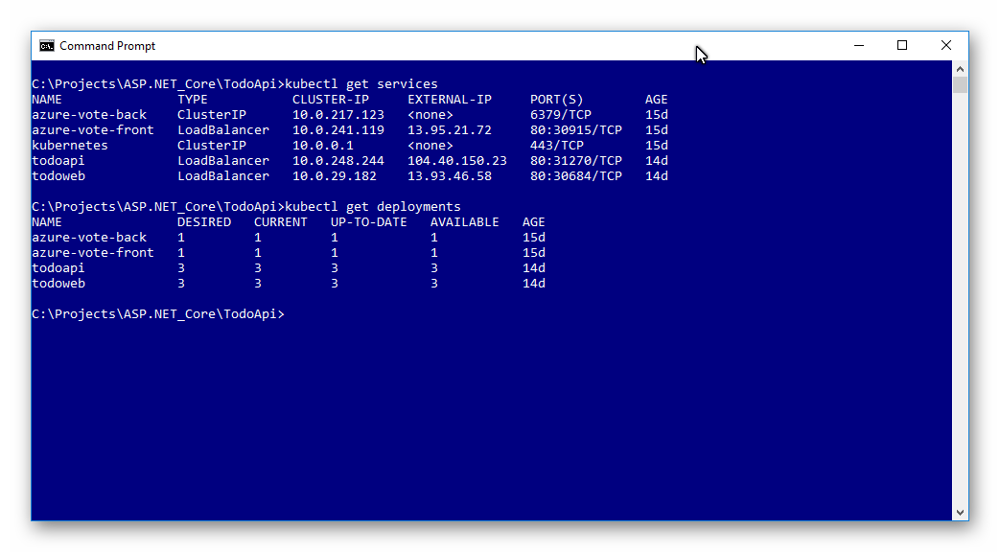 

The **spec** of both the **todoapi** and **todoweb** services define **LoadBalancer** as service type. Therefore, when you run the script, the **Azure Container Service Kubernetes** cluster creates two **Load Balancing Rules** with the **Public IP** of both services.

As you can observe, the service of type **LoadBalancer** have both a **Cluster IP**, which is a virtual, internal IP used by the **kube-proxy** running on each node of the cluster. On the contrary, if the type of the service is defined as **ClusterIP**, no Public IP is exposed over the internet, and, as consequence, no load balancing rule is created when you create a service of type **ClusterIP**. More in general, **Kubernetes ServiceTypes** allow you to specify what kind of service you want. The default is **ClusterIP**.

- **ClusterIP**: Exposes the service on a cluster-internal IP. Choosing this value makes the service only reachable from within the cluster. This is the default ServiceType.
- **NodePort**: Exposes the service on each Node’s IP at a static port (the **NodePort**). A **ClusterIP** service, to which the **NodePort** service will route, is automatically created. You’ll be able to contact the **NodePort** service, from outside the cluster, by requesting **<NodeIP>:<NodePort>**.
- **LoadBalancer**: Exposes the service externally using a cloud provider’s load balancer. **NodePort** and **ClusterIP** services, to which the external load balancer will route, are automatically created.
- **ExternalName**: Maps the service to the contents of the externalName field (e.g. foo.bar.example.com), by returning a **CNAME** record with its value. No proxying of any kind is set up. This requires version 1.7 or higher of kube-dns

In our example, if you want to provide the ability to call the REST services exposed by the **todoapi** service to external applications running outside of the **Kubernetes** cluster, and not only to the **todoweb** service running on the same cluster, you have to specify **LoadBalancer** as a service type. 

Use the **Azure Management Portal** to look at the **Frontend IP configuration** of the **Azure Load Balancer** used by **ACS** in front of the **Kubernetes** cluster nodes.

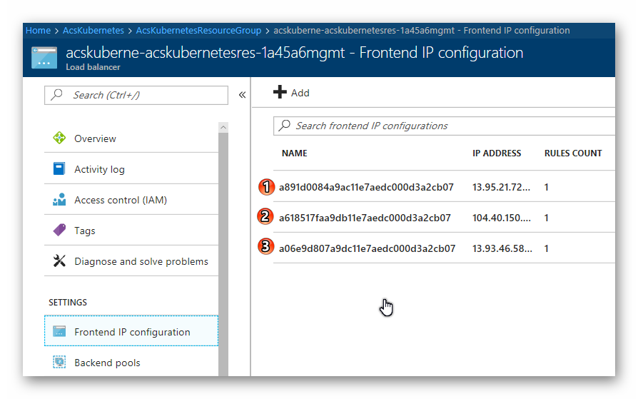 

1. The first row contains an **IP address** which corresponds to the **Public IP** of the **azure-vote-front** service. This is a quickstart sample deployed on the same **Kubernetes** cluster. For more information, see [Deploy Kubernetes cluster for Linux containers](https://docs.microsoft.com/en-us/azure/container-service/kubernetes/container-service-kubernetes-walkthrough)
2. The second row contains an **IP address** which corresponds to the **Public IP** of the **todoapi** service.
2. The third row contains an **IP address** which corresponds to the **Public IP** of the **todoweb** service.

Likewise, if you use the **Azure Management Portal** to look at the **Load balancing rules** defined on the **Load Balancer** used in front of the cluster nodes, you can note that there is a rule for each **Public IP** on the port **80**, all sharing the same **Backend Pool**

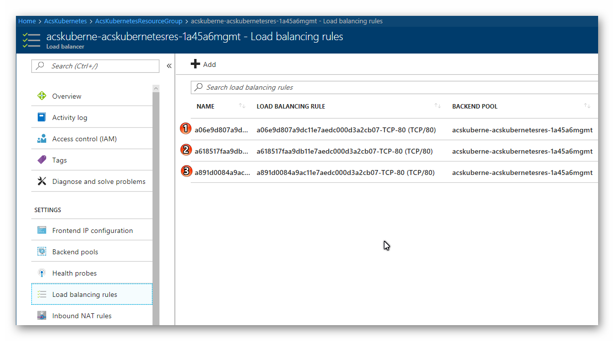 

if you use the **Azure Management Portal** to look at the **Backend pools**, you can see that in this topology, the **Azure Container Service Kubernetes** cluster uses a single backend pool composed of just 3 nodes.

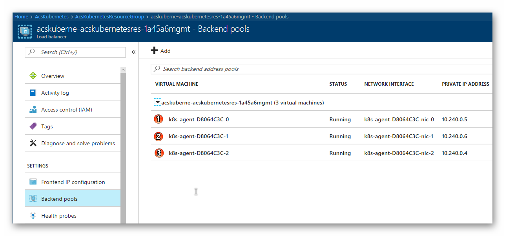 

You can retrieve information about cluster nodes also running the following command:
```Batchfile
REM Get nodes  
kubectl get nodes 
```
as shown in the following picture:

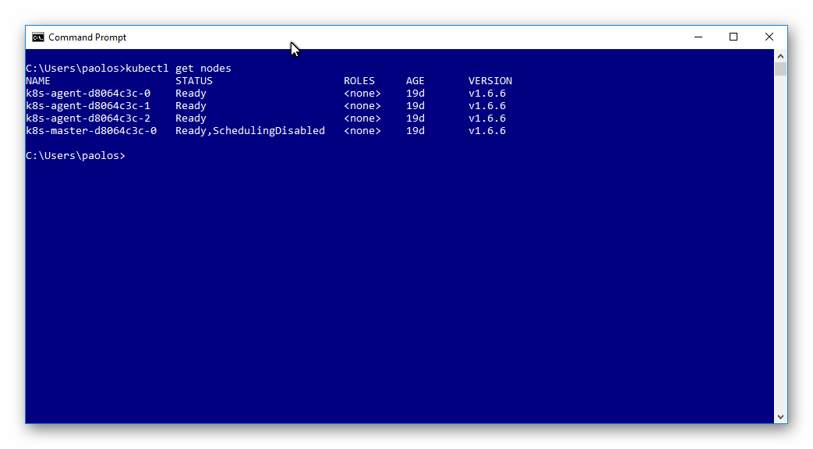 

Instead, if you want to use the **todoapi** service only as a backend service from the **todoweb** service, and you don't want to expose it publicly, you can specify **ClusterIP** as its service type. Choosing this value makes the service only reachable from within the cluster.

For more information, see:

- [Kubernetes Services](https://kubernetes.io/docs/concepts/services-networking/service/)
- [Kubernetes on Azure](https://docs.microsoft.com/en-us/azure/container-service/kubernetes/container-service-intro-kubernetes)
- [Microsoft Azure Container Service Engine - Kubernetes](https://github.com/Azure/acs-engine/blob/master/docs/kubernetes.md)

# Assign a Custom DNS to the public IP of the frontend service #
As you can see in the previous picture, I could use the public IP exposed by the **frontend** service, that is 13.93.46.58, to access the web UI. However, you can register a public domain using domain registrar like [GoDaddy][https://uk.godaddy.com/] and associate this public domain to the address exposed by the Kubernetes service using the Azure DNS service. In fact, the Azure DNS allows you to host a DNS zone and manage the DNS records for a domain in Azure. In order for DNS queries for a custom domain to reach Azure DNS, the domain has to be delegated to Azure DNS from the parent domain. Keep in mind Azure DNS is not the domain registrar. 

For more information on how to create an Azure DNS service and use the Azure CLI to manage zones and records, please see the following resources:

- [How to manage DNS Zones in Azure DNS using the Azure CLI 2.0](https://docs.microsoft.com/en-gb/azure/dns/dns-operations-dnszones-cli)
- [Manage DNS records and recordsets in Azure DNS using the Azure CLI 2.0](https://docs.microsoft.com/en-gb/azure/dns/dns-operations-recordsets-cli)

For more information to delegate a public domain to Azure DNS, see the following article:

- [Delegation of DNS zones with Azure DNS](https://docs.microsoft.com/en-us/azure/dns/dns-domain-delegation)
- [Delegate a domain to Azure DNS](https://docs.microsoft.com/en-us/azure/dns/dns-delegate-domain-azure-dns)

I personally proceeded as follows:
- I created a public domain using [GoDaddy][https://uk.godaddy.com/] called babosbird.com.
- Then, I ran the following script to create the **Azure DNS** and related record.

```Batchfile
REM Create a resource group for the DNS Zone and records
az group create --name DnsResourceGroup --location westeurope

REM Create a DNS zone called babosbird.com in the resource group DnsResourceGroup 
az network dns zone create --name babosbird.com --resource-group DnsResourceGroup --tags environment=K8s type=DNS

REM Create an A record for the public ip exposed by the public load balancer created for the TodoApi service in Kubernetes
az network dns record-set a add-record --resource-group DnsResourceGroup --zone-name babosbird.com --record-set-name www --ipv4-address 13.93.46.58
az network dns record-set a add-record --resource-group DnsResourceGroup --zone-name babosbird.com --record-set-name * --ipv4-address 13.93.46.58

REM View records
az network dns record-set list --resource-group DnsResourceGroup --zone-name babosbird.com

REM View records records at the top of the zone.
az network dns record-set list --resource-group DnsResourceGroup --zone-name babosbird.com --query "[?name=='@' && ends_with(type, 'NS')]|[0]"

REM Retrieve the name servers for your zone. These name servers should be configured with 
REM the domain name registrar where you purchased the domain name.
az network dns zone list --resource-group DnsResourceGroup --query "[?name=='babosbird.com']|[0].nameServers" --output json
```
- The last command in particular, can be used to retrieve the name servers. In fact, Azure DNS automatically creates authoritative NS records in your zone containing the assigned name servers. You need these name servers to delegate the custom domain to Azure DNS.
- Now that the DNS zone is created and you have the name servers, the parent domain needs to be updated with the Azure DNS name servers. Each registrar has their own DNS management tools to change the name server records for a domain. In the registrar's DNS management page, edit the NS records and replace the NS records with the ones Azure DNS created. In the following picture, you can see how I replaced the original NS records provided by GoDaddy with the names servers provided by the Azure DNS.
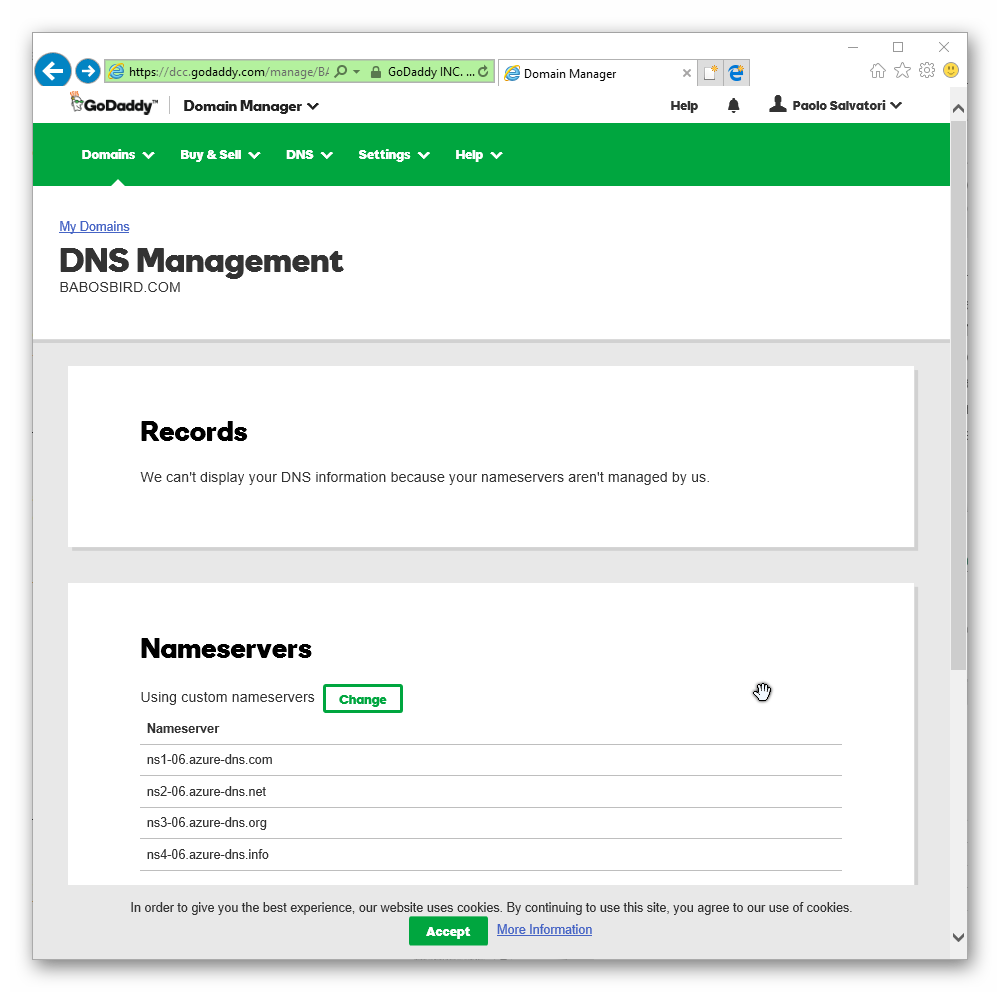
- Execute the following command to make sure that it's the frontend service IP to respond to the public domain you delegated to your Azure DNS.
```Batchfile
nslookup -type=A www.babosbird.com
```
- Now I can browse the frontend web site using the custom domain I registered.
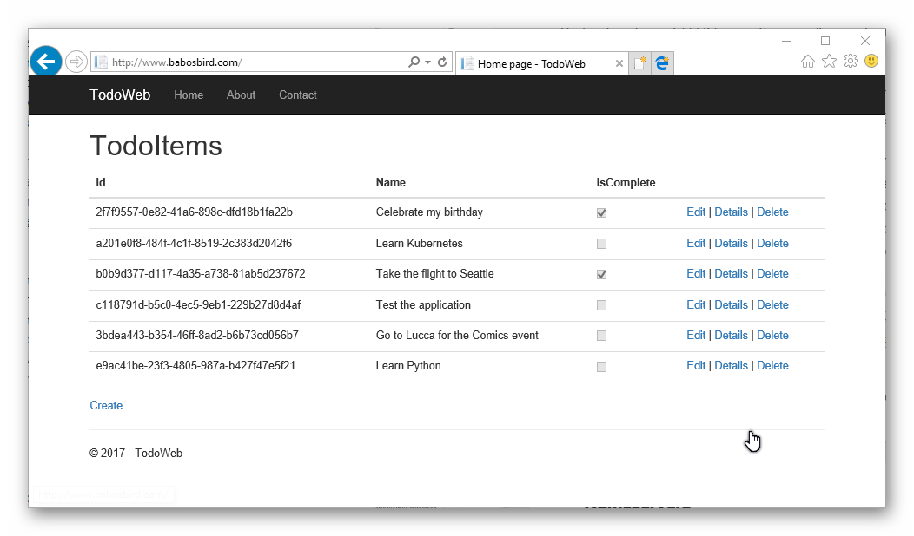

## Deploy the multi-container application to AKS from the Azure Cloud Shell ##
You can also deploy the multi-container application from the [Azure Cloud Shell](https://docs.microsoft.com/en-us/azure/cloud-shell/overview). The [Azure Cloud Shell](https://docs.microsoft.com/en-us/azure/cloud-shell/overview) utilizes Azure File storage to persist files across sessions. In order to use a YAML file that defines the **services** and **deployments** of the multi-container application from the [Azure Cloud Shell](https://docs.microsoft.com/en-us/azure/cloud-shell/overview), you can run the following batch script from your local machine using the [Azure Service Fabric CLI](https://docs.microsoft.com/en-us/azure/service-fabric/service-fabric-cli). The batch file performs the follwoing steps: 

- Creates a **Resource Group**
- Creates a **Storage Account** in the new **Resource Group**
- Creates a [File Share](https://docs.microsoft.com/en-us/azure/storage/files/storage-how-to-create-file-share) in the **Storage Account**
- Copy a YAML file containing the definition of the **services** and **deployments** of the multi-container application to the **File Share**

```Batchfile
REM Create a resource group for the storage account
az group create --name RESOURCE_GROUP --location LOCATION --output jsonc

REM Create a storage account for clouddrive
az storage account create --name STORAGE_ACCOUNT_NAME --resource-group RESOURCE_GROUP --sku Standard_RAGRS --location LOCATION

REM Create a file share in the storage account
az storage share create --name SHARE_NAME --account-name STORAGE_ACCOUNT_NAME --account-key STORAGE_ACCOUNT_PRIMARY_KEY --resource-group RESOURCE_GROUP 

REM upload the YAML containing the definition of services and deployments to the clouddrive from a command-prompt on the local machine
az storage file upload --account-name STORAGE_ACCOUNT_NAME --account-key STORAGE_ACCOUNT_PRIMARY_KEY --share-name SHARE_NAME --source PATH_TO_YAML_FILE
```
At this point, launch Azure Cloud Shell from the top navigation of the Azure portal, select **Bash** from the drop down list and execute the following commands:

```Batchfile
REM Get credentials to connect to Kubernetes cluster using kubectl
az aks get-credentials --name AksKubernetes --resource-group AksKubernetesResourceGroup 

REM Mount the file share called shell in the storage account called babo
clouddrive mount --subscription SUBSCRIPTION_ID --resource-group RESOURCE_GROUP --storage-account **STORAGE_ACCOUNT_NAME** --file-share SHARE_NAME

REM Show information about the file system
df

REM CD the cloudrive
cd /usr/USR/clouddrive
```
**Configuration**

Before runnng the above script, make the following changes:

- Replace **RESOURCE_GROUP** with the name of the new **Resource Group**.
- Replace **LOCATION** with the location of the **Resource Group** and **Storage Account**.
- Replace **STORAGE_ACCOUNT_NAME** with the name of the new **Storage Account**.
- Replace **STORAGE_ACCOUNT_PRIMARY_KEY** with the primary key of the new **Storage Account**.
- Replace **SHARE_NAME** with the name of the new **File Share** in the **Storage Account**.
- Replace **PATH_TO_YAML_FILE** with the path to the YAML containing the definition of the **services** and **deployments** of the multi-container application. 
- Replace **SUBSCRIPTION_ID** with the id of your **Azure Subscription**.
- Replace **USR** with your username on the **Azure Cloud Shell**

For more information on how to mount a [File Share](https://docs.microsoft.com/en-us/azure/storage/files/storage-how-to-create-file-share) from an [Azure Cloud Shell](https://docs.microsoft.com/en-us/azure/cloud-shell/overview), see [Persist files in Azure Cloud Shell](https://docs.microsoft.com/en-us/azure/cloud-shell/persisting-shell-storage). 

You can also deploy the multi-container application using the **Azure CLI** on your local machine or from the [Azure Cloud Shell](https://docs.microsoft.com/en-us/azure/cloud-shell/overview).

The first step is to create a YAML file to define a **secret**. Each item in the file must be base64 encoded. The multi-container sample uses a **secret** to define the value of the following **environment variables**:

  - cosmosDbEndpointUri
  - cosmosDBPrimaryKey
  - cosmosDbDatabaseName
  - cosmosDbCollectionName
  - serviceBusConnectionString
  - dataProtectionBlobStorageConnectionString
  - applicationInsightsInstrumentationKey

The following YAML file can be used to create a **secret** object named **todolist-secret** that contains a value for the above environment variables.

**todolist-secret.yml**
```yaml
apiVersion: v1
kind: Secret
metadata:
  name: todolist-secret
type: Opaque
data:
  cosmosDbEndpointUri: BASE64-ENCODED-COSMOS-DB-ENDPOINT-URI
  cosmosDBPrimaryKey: BASE64-ENCODED-COSMOS-DB-PRIMARY-KEY
  cosmosDbDatabaseName: BASE64-ENCODED-COSMOS-DB-DATABASE-NAME
  cosmosDbCollectionName: BASE64-ENCODED-COSMOS-DB-COLLECTION-NAME
  serviceBusConnectionString: BASE64-ENCODED-SERVICE-BUS-CONNECTION-STRING
  dataProtectionBlobStorageConnectionString: BASE64-ENCODED-BLOB-STORAGE-CONNECTION-STRING
  applicationInsightsInstrumentationKey: BASE64-ENCODED-APP-INSIGHTS-INSTRUMENTATION-KEY
```
The following script can be used to create the **todolist-secret** object in the Kubernetes cluster.

**create-secret-in-kubernetes.cmd**
```batchfile
REM Deploy azure-vote sample application  
kubectl create --filename todolist-secret.yml --record
```

You can now deploy the application. This time use a YAML file configured to pull **Docker** images from an **Azure Container Service** repository.

**kubernetes-deployments-and-services-from-azure-container-registry.yml**
```yaml
apiVersion: apps/v1beta1
kind: Deployment
metadata:
  name: todoapi
  labels:
    app: todoapi
spec:
  replicas: 3
  selector:
    matchLabels:
      app: todoapi
  strategy:
    rollingUpdate:
      maxSurge: 1
      maxUnavailable: 1
  minReadySeconds: 5
  template:
    metadata:
      labels:
        app: todoapi
    spec:
      containers:
      - name: todoapi
        image: AZURE_CONTAINER_REGISTRY_NAME.azurecr.io/todoapi:v1
        ports:
        - containerPort: 80
        env:
        - name: ASPNETCORE_ENVIRONMENT
          value: "Development"
        - name: RepositoryService__CosmosDb__EndpointUri
          valueFrom:
            secretKeyRef:
                name: todolist-secret
                key: cosmosDbEndpointUri
        - name: RepositoryService__CosmosDb__PrimaryKey
          valueFrom:
            secretKeyRef:
                name: todolist-secret
                key: cosmosDBPrimaryKey
        - name: RepositoryService__CosmosDb__DatabaseName
          valueFrom:
            secretKeyRef:
                name: todolist-secret
                key: cosmosDbDatabaseName
        - name: RepositoryService__CosmosDb__CollectionName
          valueFrom:
            secretKeyRef:
                name: todolist-secret
                key: cosmosDbCollectionName
        - name: NotificationService__ServiceBus__ConnectionString
          valueFrom:
            secretKeyRef:
                name: todolist-secret
                key: serviceBusConnectionString
        - name: NotificationService__ServiceBus__QueueName
          value: "todoapi"
        - name: DataProtection__BlobStorage__ConnectionString
          valueFrom:
            secretKeyRef:
                name: todolist-secret
                key: dataProtectionBlobStorageConnectionString
        - name: DataProtection__BlobStorage__ContainerName
          value: "todoapi"
        - name: ApplicationInsights__InstrumentationKey
          valueFrom:
            secretKeyRef:
                name: todolist-secret
                key: applicationInsightsInstrumentationKey
---
apiVersion: v1
kind: Service
metadata:
  name: todoapi
  labels:
    app: todoapi
spec:
  type: LoadBalancer
  ports:
  - protocol: TCP
    port: 80
  selector:
    app: todoapi
---
apiVersion: apps/v1beta1
kind: Deployment
metadata:
  name: todoweb
  labels:
    app: todoweb
spec:
  replicas: 3
  selector:
    matchLabels:
      app: todoweb
  strategy:
    rollingUpdate:
      maxSurge: 1
      maxUnavailable: 1
  minReadySeconds: 5 
  template:
    metadata:
      labels:
        app: todoweb
    spec:
      containers:
      - name: todoweb
        image: AZURE_CONTAINER_REGISTRY_NAME.azurecr.io/todoweb:v1
        ports:
        - containerPort: 80
        env:
        - name: ASPNETCORE_ENVIRONMENT
          value: "Development"
        - name: TodoApiService__EndpointUri
          value: "todoapi"
        - name: DataProtection__BlobStorage__ConnectionString
          valueFrom:
            secretKeyRef:
                name: todolist-secret
                key: dataProtectionBlobStorageConnectionString
        - name: DataProtection__BlobStorage__ContainerName
          value: "todoweb"
        - name: ApplicationInsights__InstrumentationKey
          valueFrom:
            secretKeyRef:
                name: todolist-secret
                key: applicationInsightsInstrumentationKey
---
apiVersion: v1
kind: Service
metadata:
  name: todoweb
  labels:
    app: todoweb
spec:
  type: LoadBalancer
  ports:
  - protocol: TCP
    port: 80
  selector:
    app: todoweb
```

**Configuration**

Before deploying the application to your managed **Kubernetes** service, open the YAML file and make the following changes:

- Replace **AZURE_CONTAINER_REGISTRY_NAME** with the name of your **Azure Container Registry**.

Finally, run the following command from the Azure Cloud Shell to deploy the multi-container application to your Kubernetes cluster.

```Batchfile
kubectl create --filename kubernetes-deployments-and-services-from-azure-container-registry.yml --record
```

You can run the following command to display the **EXTERNAL-IP** of the **todoweb** frontend service.

```Batchfile
kubectl get services
```
as shown in the following picture:

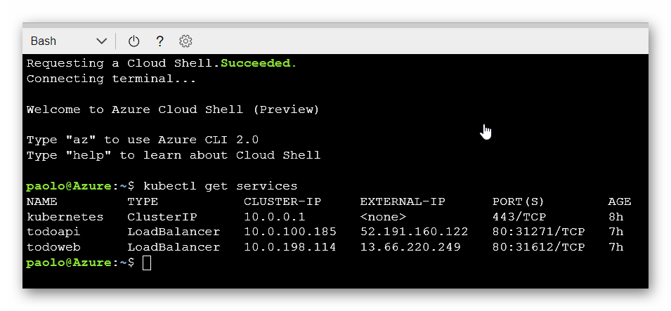

Finally, to verify that the application works as expected we can browse to the **EXTERNAL-IP** of the **todoweb** frontend service, as shown in the following picture.

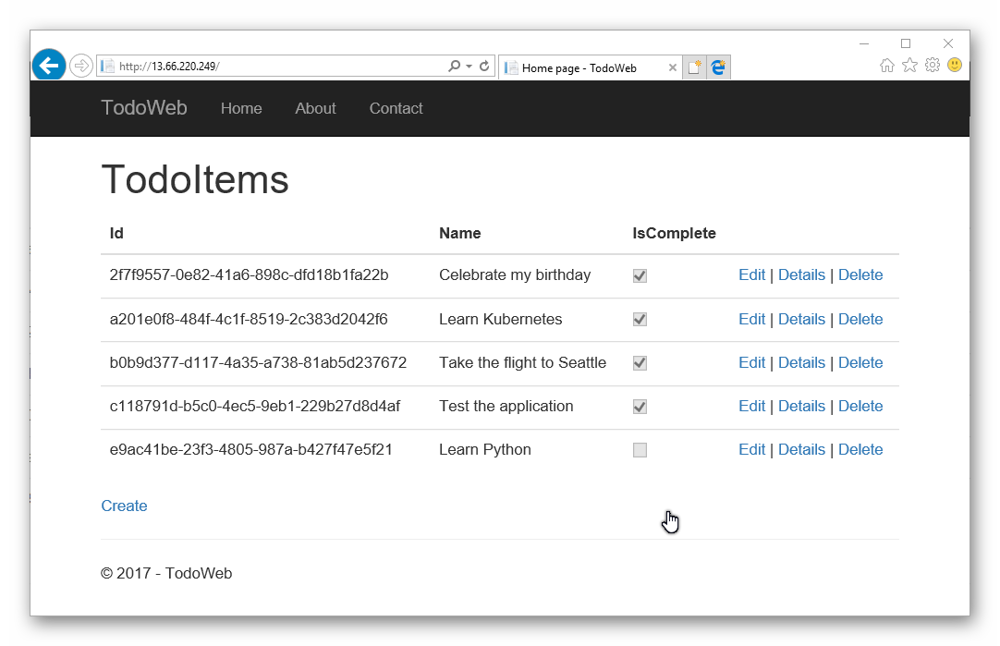

# Configure Nginx Ingress Controller for TLS termination on Kubernetes #
So far, we have seen how to configure both the **todoweb** frontend service and **todoapi** backend service to expose each a public HTTP endpoint. Now, let's assume we want to expose only the **todoweb** frontend service and configure it to use an HTTPS endpoint instead of an HTTP endpoint.
To implement TLS termination in our Kubernetes cluster, we'll use an [Ingress](https://kubernetes.io/docs/concepts/services-networking/ingress/) object and the [Nginx Ingress controller](https://github.com/kubernetes/ingress-nginx). This component is a daemon, deployed as a Kubernetes **Pod**, that watches the apiserver's /ingresses endpoint for updates to the **Ingress** resource. The [Nginx Ingress controller](https://github.com/kubernetes/ingress-nginx) can be used to implement patterns like path-based fanout, SSL passthrough, TLS termination, basic or digest http authentication. For more information, see [Advanced Ingress Configuration](https://docs.giantswarm.io/guides/advanced-ingress-configuration/)

You can deploy the [Nginx Ingress controller](https://github.com/kubernetes/ingress-nginx) to your Kubernetes cluster in Azure by using the **kubectl** CLI or using Helm. [Helm](https://docs.helm.sh/) is a tool for managing Kubernetes charts. Charts are packages of pre-configured Kubernetes resources. You can use Helm to:

 - Find and use popular software packaged as Kubernetes charts
 - Share your own applications as Kubernetes charts
 - Create reproducible builds of your Kubernetes applications
 - Intelligently manage your Kubernetes manifest files
 - Manage releases of Helm packages

For more information, see the following resources: 
 
 - [Kubernetes Helm](https://github.com/kubernetes/helm)
 - [Nginx Ingress Controller Deployment](https://github.com/kubernetes/ingress-nginx/blob/master/deploy/README.md).

You can use the following **Bash** script to install and initialize [Helm](https://docs.helm.sh/). In particular, the **helm init** command is used to install Helm components in a Kubernetes cluster and make client-side configurations.

**install-helm.sh**
```bash
#!/bin/bash
# Install helm on the local machine

# Download Helm
curl https://raw.githubusercontent.com/kubernetes/helm/master/scripts/get > get_helm.sh

# Make get_helm executable
$ chmod 700 get_helm.sh

# Execute get_helm.sh
$ ./get_helm.sh

# Initialize helm
helm init
```
For more information, see [Use Helm with Azure Container Service (AKS)](https://docs.microsoft.com/en-us/azure/aks/kubernetes-helm).

Then, you can use the following **Bash** script to install the [Nginx Ingress controller](https://github.com/kubernetes/ingress-nginx) in your Kubernetes cluster.

**install-nginx-ingress-controller.sh**
```bash
# Installs nginx-ingress using helm 
helm install stable/nginx-ingress -n nginx-ingress
```

You can you can use the following **Bash** script to scale out the number of replicas used by the [Nginx Ingress controller](https://github.com/kubernetes/ingress-nginx) to from 1 to 3.

**scale-nginx-ingress-controller-replicas.sh**
```bash
# Scale the number of replicas of the nginx-ingress-nginx-ingress-controller to 3
kubectl scale deployment nginx-ingress-nginx-ingress-controller --replicas=3 

# Scale the number of replicas of the nginx-ingress-nginx-ingress-default-backend to 3
kubectl scale deployment nginx-ingress-nginx-ingress-default-backend --replicas=3
```

The next step is to create a **secret** containing the certificate and private key used for TLS termination. We can use **openssl** utility to create a test certificate. You can use the following **Bash** script to install **openssl**.

**install-open-ssl.sh**
```bash
# Install openssl utility 
sudo apt update && sudo apt install openssl
```
Use the following **Bash** script to create a self-signed certificate for testing.

**create-certificate.sh**
```bash
# Create a self-signed certificate. Note: private and public keys are saved locally
openssl req -x509 -nodes -days 3650 -newkey rsa:2048 -keyout tls.key -out tls.crt -subj "/CN=nginxsvc/O=nginxsvc"
```

You can now run the following **Bash** script to create a **Secret** in your Kubernetes cluster using the self-signed certificate and its private key. **Note**: in a production environment, you should replace the self-signed certificate with a valid certificate issued by a trusted certificate authority.

**create-tls-secret.sh**
```bash
# Use the private and public key to create a secret used for SSL termination
kubectl create secret tls tls-secret --key tls.key --cert tls.crt
```

**Note**: the data keys must be named tls.crt and tls.key.

As an alternative, you can also the following YAML file to define the **tls-secret**:

**tls-secret.yml**
```yaml
apiVersion: v1
kind: Secret
type: kubernetes.io/tls
metadata:
  name: tls-secret
data:
  tls.crt: [BASE64_ENCODED_CERT]
  tls.key: [BASE64_ENCODED_KEY]
```

You can run the following **Bash** command to create the **tls-secret** in your Kubernetes cluster using the above YAML file.

```bash
# Create tls-secret using YAML file
kubectl create -f /mnt/c/[PATH-TO-YAML-FILE]/tls-secret.yml
```

Now you are ready to install the multi-container application to Kubernetes. In this section we'll see how to use the **kubectl** CLI to create services and deployments using the definitions contained in a YAML file. In the next section, we'll see how to create a **Helm** chart and use it to deploy the application to Kubernetes. 

**kubernetes-deployments-and-services-from-docker-hub-ssl.yml**
```yaml
apiVersion: apps/v1beta1
kind: Deployment
metadata:
  name: ssl-todoapi
  labels:
    app: ssl-todoapi
spec:
  replicas: 3
  selector:
    matchLabels:
      app: ssl-todoapi
  strategy:
    rollingUpdate:
      maxSurge: 1
      maxUnavailable: 1
  minReadySeconds: 5
  template:
    metadata:
      labels:
        app: ssl-todoapi
    spec:
      containers:
      - name: ssl-todoapi
        image: DOCKER_HUB_REPOSITORY/todoapi:v1
        ports:
        - containerPort: 80
        env:
        - name: ASPNETCORE_ENVIRONMENT
          value: "Development"
        - name: RepositoryService__CosmosDb__EndpointUri
          valueFrom:
            secretKeyRef:
                name: todolist-secret
                key: cosmosDbEndpointUri
        - name: RepositoryService__CosmosDb__PrimaryKey
          valueFrom:
            secretKeyRef:
                name: todolist-secret
                key: cosmosDBPrimaryKey
        - name: RepositoryService__CosmosDb__DatabaseName
          valueFrom:
            secretKeyRef:
                name: todolist-secret
                key: cosmosDbDatabaseName
        - name: RepositoryService__CosmosDb__CollectionName
          valueFrom:
            secretKeyRef:
                name: todolist-secret
                key: cosmosDbCollectionName
        - name: NotificationService__ServiceBus__ConnectionString
          valueFrom:
            secretKeyRef:
                name: todolist-secret
                key: serviceBusConnectionString
        - name: NotificationService__ServiceBus__QueueName
          value: "todoapi"
        - name: DataProtection__BlobStorage__ConnectionString
          valueFrom:
            secretKeyRef:
                name: todolist-secret
                key: dataProtectionBlobStorageConnectionString
        - name: DataProtection__BlobStorage__ContainerName
          value: "todoapi"
        - name: ApplicationInsights__InstrumentationKey
          valueFrom:
            secretKeyRef:
                name: todolist-secret
                key: applicationInsightsInstrumentationKey
---
apiVersion: v1
kind: Service
metadata:
  name: ssl-todoapi
  labels:
    app: ssl-todoapi
spec:
  type: ClusterIP
  ports:
  - port: 80
    targetPort: 80
    protocol: TCP
    name: http
  selector:
    app: ssl-todoapi
---
apiVersion: apps/v1beta1
kind: Deployment
metadata:
  name: ssl-todoweb
  labels:
    app: ssl-todoweb
spec:
  replicas: 3
  selector:
    matchLabels:
      app: ssl-todoweb
  strategy:
    rollingUpdate:
      maxSurge: 1
      maxUnavailable: 1
  minReadySeconds: 5 
  template:
    metadata:
      labels:
        app: ssl-todoweb
    spec:
      containers:
      - name: ssl-todoweb
        image: DOCKER_HUB_REPOSITORY/todoweb:v1
        ports:
        - containerPort: 80
        env:
        - name: ASPNETCORE_ENVIRONMENT
          value: "Development"
        - name: TodoApiService__EndpointUri
          value: "ssl-todoapi"
        - name: DataProtection__BlobStorage__ConnectionString
          valueFrom:
            secretKeyRef:
                name: todolist-secret
                key: dataProtectionBlobStorageConnectionString
        - name: DataProtection__BlobStorage__ContainerName
          value: "todoweb"
        - name: ApplicationInsights__InstrumentationKey
          valueFrom:
            secretKeyRef:
                name: todolist-secret
                key: applicationInsightsInstrumentationKey
---
apiVersion: v1
kind: Service
metadata:
  name: ssl-todoweb
  labels:
    app: ssl-todoweb
spec:
  type: ClusterIP
  ports:
  - port: 80
    targetPort: 80
    protocol: TCP
    name: http
  selector:
    app: ssl-todoweb
```
**Configuration**

Before deploying the application to your managed **Kubernetes** service, open the YAML file and make the following changes:

- Replace **AZURE_CONTAINER_REGISTRY_NAME** with the name of your **Azure Container Registry**.

**Observations**

Reading the above YAML file you can note the following: 

 - The name of deployments and services is now prefixed with **ssl-**
 - The type of both **ssl-todoapi** and **ssl-todoweb** services is now **ClusterIP** instead of **LoadBalancer**. As noted above, if you adopt the **ClusterIP** service type, a service is exposed only on a cluster-internal IP. Choosing this value makes the service only reachable from within the cluster. This is the default **ServiceType**. If you instead adopt the **LoadBalancer** service type, a service is exposed externally using a cloud provider’s load balancer, that is, in case of AKS, the [Azure Load Balancer](https://docs.microsoft.com/en-us/azure/load-balancer/load-balancer-overview) posed in front of the cluster nodes. For more information, see [Services](https://kubernetes.io/docs/concepts/services-networking/service/) on Kubernetes documentation.

You can now run the following **Bash** script to deploy the **ssl-todoapi** and **ssl-todoweb** services to your Kubernetes cluster.

```Batchfile
# Deploy the TodoList application using kubectl or helm
kubectl create -f /mnt/c/[PATH-TO-YAML-FILE]/kubernetes-deployments-and-services-from-docker-hub-ssl.yml --record
```
In order to expose the **ssl-todoweb** frontend service with a HTTPS public endpoint, you have to create an [Ingress](https://kubernetes.io/docs/concepts/services-networking/ingress/) object in the same namespace as the **tls-secret** object.

**nginx-ingress.yml**
```yaml
apiVersion: extensions/v1beta1
kind: Ingress
metadata:
  name: nginx-ingress
spec:
  tls:
  - secretName: tls-secret
  backend:
    serviceName: ssl-todoweb
```

You can run the following **Bash** command to create the **nginx-ingress** in your Kubernetes cluster using the above YAML file.

```bash
# Create tls-secret using YAML file
kubectl create -f /mnt/c/[PATH-TO-YAML-FILE]/nginx-ingress.yml
```

We have configured the **Nginx Ingress Controller** to implement SSL termination and route traffic to our service **ssl-todoweb** via HTTP. You can run the following **Bash** command to display the **EXTERNAL-IP** exposed by the **Nginx Ingress Controller** service.

```bash
kubectl get service nginx-ingress-nginx-ingress-controller
```
as shown in the following picture:

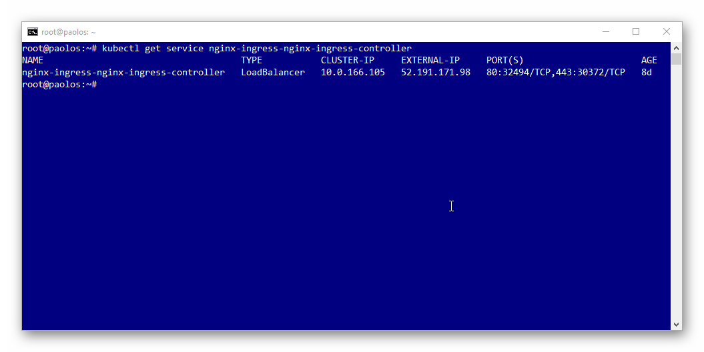

Finally, to verify that the application works as expected we can browse to the **EXTERNAL-IP** of the **Nginx Ingress Controller** frontend service, as shown in the following picture.

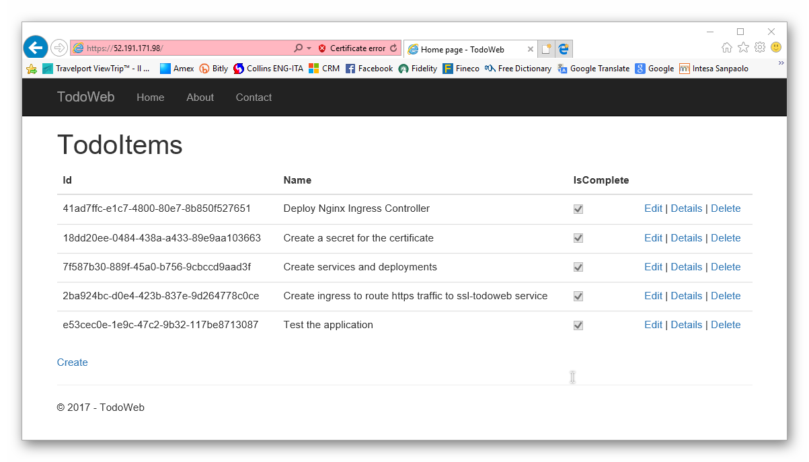

# Use Helm to package and deploy your application to Kubernetes #
As mentioned above, [Helm](https://docs.helm.sh/) is a tool for managing Kubernetes charts. Charts are packages of pre-configured Kubernetes resources. You can use Helm to:

 - Find and use popular software packaged as Kubernetes charts
 - Share your own applications as Kubernetes charts
 - Create reproducible builds of your Kubernetes applications
 - Intelligently manage your Kubernetes manifest files
 - Manage releases of Helm packages

Helm uses a packaging format called charts. A chart is a collection of files that describe a related set of Kubernetes resources. Charts are created as files and structured in a particular directory tree, then they can be packaged into versioned archives to be deployed. For more information see [Charts](https://docs.helm.sh/developing_charts/#charts) in the Helm documentation.

A single chart can be used to create the services and deployments that compose the **todolist** multi-container application. The chart is organized as a collection of files inside of a directory. The directory name is the name of the chart, so in our case is equal to **todolist**. The following picture shows the structure of the directory structure.  

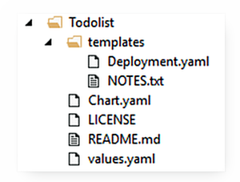

**Description**
  
 - **Chart.yaml**: this YAML file contains information about the chart, like name, version, keywords, description, etc.
 - **LICENSE**: this is an optional plain text file containing the license for 
  the chart.
- **README.md**: this is an optional, human-readable README file
- **requirements.yaml**:   this is an optional YAML file listing dependencies for the chart. This file is not used in this demo as the **todolist** does not have any dependency on other charts.
- **values.yaml**: this file is manndatory and contains the default configuration values for this chart.
- **charts/**: this is an optional directory containing any charts upon which this chart depends. This directory is not used in this demo as the **todolist** does not have any dependency on other charts.
- **templates/**: this is an optional directory of templates that, when combined with values, will generate valid Kubernetes manifest files. 
 - **templates/Deployment.yaml**: this YAML file contains the definition of the **todoapi** and **todoweb** services and deployments.
- **templates/NOTES.txt** this is optional plain text file containing short usage notes.

Below you can see the content of the main files used by the chart.

**Chart.yaml**

```yaml
name: TodoList
version: 1.0.0
description: todolist multi-container app
keywords:
  - todoapi
home: https://github.com/paolosalvatori/service-fabric-acs-kubernetes-multi-container-app
sources:
  - https://github.com/paolosalvatori/service-fabric-acs-kubernetes-multi-container-app
maintainers: # (optional)
  - name: Paolo Salvatori
    email: paolos@microsoft.com
    url: https://github.com/paolosalvatori
engine: gotpl 
appVersion: 1.0.0
```
**values.yaml**

```yaml
imageRegistry: "paolosalvatori"
frontendImage: "todoweb"
backendImage: "todoapi"
frontendTag: "v2"
backendTag: "v2"
environment: "Development"
frontend: "todoweb"
backend: "todoapi"
frontendServiceType: "LoadBalancer"
backendServiceType: "LoadBalancer"
queueName: "todoapi"
```

**templates/Deployment.yaml**

```yaml
apiVersion: apps/v1beta1
kind: Deployment
metadata:
  name: {{.Values.backend}}
  labels:
    app: {{.Values.backend}}
spec:
  replicas: 3
  selector:
    matchLabels:
      app: {{.Values.backend}}
  strategy:
    rollingUpdate:
      maxSurge: 1
      maxUnavailable: 1
  minReadySeconds: 5
  template:
    metadata:
      labels:
        app: {{.Values.backend}}
    spec:
      containers:
      - name: {{.Values.backend}}
        image: {{.Values.imageRegistry}}/{{.Values.backendImage}}:{{.Values.backendTag}}
        ports:
        - containerPort: 80
        env:
        - name: ASPNETCORE_ENVIRONMENT
          value: {{.Values.environment}}
        - name: RepositoryService__CosmosDb__EndpointUri
          valueFrom:
            secretKeyRef:
                name: todolist-secret
                key: cosmosDbEndpointUri
        - name: RepositoryService__CosmosDb__PrimaryKey
          valueFrom:
            secretKeyRef:
                name: todolist-secret
                key: cosmosDBPrimaryKey
        - name: RepositoryService__CosmosDb__DatabaseName
          valueFrom:
            secretKeyRef:
                name: todolist-secret
                key: cosmosDbDatabaseName
        - name: RepositoryService__CosmosDb__CollectionName
          valueFrom:
            secretKeyRef:
                name: todolist-secret
                key: cosmosDbCollectionName
        - name: NotificationService__ServiceBus__ConnectionString
          valueFrom:
            secretKeyRef:
                name: todolist-secret
                key: serviceBusConnectionString
        - name: NotificationService__ServiceBus__QueueName
          value: {{.Values.queueName}}
        - name: DataProtection__BlobStorage__ConnectionString
          valueFrom:
            secretKeyRef:
                name: todolist-secret
                key: dataProtectionBlobStorageConnectionString
        - name: DataProtection__BlobStorage__ContainerName
          value: {{.Values.backend}}
        - name: ApplicationInsights__InstrumentationKey
          valueFrom:
            secretKeyRef:
                name: todolist-secret
                key: applicationInsightsInstrumentationKey
---
apiVersion: v1
kind: Service
metadata:
  name: {{.Values.backend}}
spec:
  type: {{.Values.backendServiceType}}
  ports:
  - protocol: TCP
    port: 80
  selector:
    app: {{.Values.backend}}
---
apiVersion: apps/v1beta1
kind: Deployment
metadata:
  name: {{.Values.frontend}}
  labels:
    app: {{.Values.frontend}}
spec:
  replicas: 3
  selector:
    matchLabels:
      app: {{.Values.frontend}}
  strategy:
    rollingUpdate:
      maxSurge: 1
      maxUnavailable: 1
  minReadySeconds: 5 
  template:
    metadata:
      labels:
        app: {{.Values.frontend}}
    spec:
      containers:
      - name: {{.Values.frontend}}
        image: {{.Values.imageRegistry}}/{{.Values.frontendImage}}:{{.Values.frontendTag}}
        ports:
        - containerPort: 80
        env:
        - name: ASPNETCORE_ENVIRONMENT
          value: {{.Values.environment}}
        - name: TodoApiService__EndpointUri
          value: {{.Values.backend}}
        - name: DataProtection__BlobStorage__ConnectionString
          valueFrom:
            secretKeyRef:
                name: todolist-secret
                key: dataProtectionBlobStorageConnectionString
        - name: DataProtection__BlobStorage__ContainerName
          value: {{.Values.frontend}}
        - name: ApplicationInsights__InstrumentationKey
          valueFrom:
            secretKeyRef:
                name: todolist-secret
                key: applicationInsightsInstrumentationKey
---
apiVersion: v1
kind: Service
metadata:
  name: {{.Values.frontend}}
spec:
  type: {{.Values.frontendServiceType}}
  ports:
  - protocol: TCP
    port: 80
  selector:
    app: {{.Values.frontend}}
```

**Observations**

Examining the files above, you can note the following:

 - **Helm Chart templates** are written in the [Go template language](https://golang.org/pkg/text/template/), with the addition of 50 or so add-on template functions from the Sprig library and a few other specialized functions.
 - **Actions** are data evaluations or control structures. They are delimited by "{{" and "}}"; all text outside actions is copied to the output unchanged.
 - **Actions** can be used as placeholders for values defined in the **values.yaml** file. This technique is extremely powerful, because it allows to parametrize the entire template, including the service type, container image location, service and deployment name, etc.
 - When using the **helm** CLI, a user can override all or part of the values provided in the **values.yaml** file in the chart by specifing an alternate **values.yaml** file. Later on, we'll see how to use this technique to customize a deployment.

You can run the following **Bash** script to package the chart. This operation  creates a compressed TAR Archive file with the following format **ChartName-ChartVersion.tgz** in the current folder, in our case **TodoList-1.0.0.tgz**.

```bash
# Build package
helm package /mnt/c/[PATH-TO-CHART]/TodoList
```

If you want to install the **todolist** application, you can run the following **Bash** comamand.

```bash
# Install package
helm install --name todolist TodoList-1.0.0.tgz
```

Now, let's assume we want to deploy a version of the application that uses HTTPS instead of HTTP. we want to change the service type for both the **todoapi** and **todoweb** services from **LoadBalancer** to **ClusterIP** and we want to add the **ssl-** prefix to the name of the corresponding services and deployments. You can accomplish this task simply creating the following **ssl-todolist-values.yaml** file

```yaml
frontend: "ssl-todoweb"
backend: "ssl-todoapi"
frontendServiceType: "ClusterIP"
backendServiceType: "ClusterIP"
```

and by running this **Bash** command:

```bash
# Install package for ssl-todolist
helm install --name ssl-todolist --values /mnt/c/[PATH-TO-CHART]/ssl-todolist-values.yaml TodoList-1.0.0.tgz
```

# Services #
This section provides a brief introduction of the services used by the solution.

## Azure Service Fabric ##
Azure Service Fabric is a distributed systems platform that makes it easy to package, deploy, and manage scalable and reliable microservices and containers. Service Fabric also addresses the significant challenges in developing and managing cloud native applications. Developers and administrators can avoid complex infrastructure problems and focus on implementing mission-critical, demanding workloads that are scalable, reliable, and manageable. Service Fabric represents the next-generation platform for building and managing these enterprise-class, tier-1, cloud-scale applications running in containers. For more information, see [Overview of Azure Service Fabric](https://docs.microsoft.com/en-us/azure/service-fabric/service-fabric-overview).

## Kubernetes ##
Kubernetes is a powerful system for managing containerized applications in a clustered environment. It aims to provide better ways of managing related, distributed components across varied infrastructure.
Kubernetes is an open-source platform designed to automate deploying, scaling, and operating application containers. With Kubernetes, you are able to quickly and efficiently respond to customer demand:

- Deploy your applications quickly and predictably.
- Scale your applications on the fly.
- Self-healing
- Roll out new features seamlessly.
- Limit hardware usage to required resources only.

For more information, see [What is Kubernetes?](https://kubernetes.io/docs/concepts/overview/what-is-kubernetes/).

## Azure Container Service for Kubernetes ##
Azure Container Service for Kubernetes makes it simple to create, configure, and manage a cluster of virtual machines that are preconfigured to run containerized applications. This enables you to use your existing skills, or draw upon a large and growing body of community expertise, to deploy and manage container-based applications on Microsoft Azure. For more information, see [Azure Container Service for Kubernetes](https://docs.microsoft.com/en-us/azure/container-service/kubernetes/container-service-intro-kubernetes).

## Managed Kubernetes Service ##
Azure Container Service (AKS) manages your hosted Kubernetes environment, making it quick and easy to deploy and manage containerized applications without container orchestration expertise. It also eliminates the burden of ongoing operations and maintenance by provisioning, upgrading, and scaling resources on demand, without taking your applications offline. For more information, see [Azure Container Service (AKS)](https://docs.microsoft.com/en-us/azure/aks/).

## Application Insights ##
Application Insights is an extensible Application Performance Management (APM) service for web developers on multiple platforms. Use it to monitor your live web application. It will automatically detect performance anomalies. It includes powerful analytics tools to help you diagnose issues and to understand what users actually do with your app. It's designed to help you continuously improve performance and usability. It works for apps on a wide variety of platforms including .NET, Node.js and J2EE, hosted on-premises or in the cloud. For more information, see [What is Application Insights?](https://docs.microsoft.com/en-us/azure/application-insights/app-insights-overview).

## Service Bus Messaging ##
Microsoft Azure Service Bus is a reliable message delivery service. The purpose of this service is to make communication easier. When two or more parties want to exchange data, they need a communication facilitator. Service Bus is a brokered, or third-party communication mechanism. Service Bus messaging with queues, topics, and subscriptions can be thought of as asynchronous, or "temporally decoupled." Producers (senders) and consumers (receivers) do not have to be online at the same time. The messaging infrastructure reliably stores messages in a "broker" (for example, a queue) until the consuming party is ready to receive them. For more information, see [Service Bus Messaging](https://docs.microsoft.com/en-us/azure/service-bus-messaging/service-bus-messaging-overview).

## Azure Cosmos DB ##
Azure Cosmos DB is Microsoft's globally distributed, multi-model database. With the click of a button, Azure Cosmos DB enables you to elastically and independently scale throughput and storage across any number of Azure's geographic regions. Azure Cosmos DB supports multiple data models and popular APIs for accessing and querying data. The sample uses the Document DB API which provides a schema-less JSON database engine with SQL querying capabilities. For more information, see [About Azure Cosmos DB](https://docs.microsoft.com/en-us/azure/cosmos-db/introduction)

## Azure Key Vault ##
Azure Key Vault helps safeguard cryptographic keys and secrets used by cloud applications and services. By using Key Vault, you can encrypt keys and secrets (such as authentication keys, storage account keys, data encryption keys, .PFX files, and passwords) by using keys that are protected by hardware security modules (HSMs). For added assurance, you can import or generate keys in HSMs. If you choose to do this, Microsoft processes your keys in FIPS 140-2 Level 2 validated HSMs (hardware and firmware). Key Vault streamlines the key management process and enables you to maintain control of keys that access and encrypt your data. Developers can create keys for development and testing in minutes, and then seamlessly migrate them to production keys. Security administrators can grant (and revoke) permission to keys, as needed.For more information, see [What is Azure Key Vault?](https://docs.microsoft.com/en-us/azure/key-vault/key-vault-whatis)

## Azure Container Registry ##
Azure Container Registry is a managed Docker registry service based on the open-source Docker Registry 2.0. Create and maintain Azure container registries to store and manage your private Docker container images. Use container registries in Azure with your existing container development and deployment pipelines, and draw on the body of Docker community expertise. For more information, see [Introduction to private Docker container registries in Azure](https://docs.microsoft.com/en-gb/azure/container-registry/container-registry-intro).

## Azure DNS Service ##
The Domain Name System, or DNS, is responsible for translating (or resolving) a website or service name to its IP address. Azure DNS is a hosting service for DNS domains, providing name resolution using Microsoft Azure infrastructure. By hosting your domains in Azure, you can manage your DNS records using the same credentials, APIs, tools, and billing as your other Azure services. For more information, see [Azure DNS overview](https://docs.microsoft.com/en-gb/azure/dns/dns-overview).

# More information
The [Service Fabric container documentation](https://docs.microsoft.com/en-us/azure/service-fabric/service-fabric-linux-overview) provides details on the container features and scenarios.

The following are other useful links which contain more in depth information

- [Create a Linux Container Application](https://docs.microsoft.com/en-us/azure/service-fabric/service-fabric-get-started-containers-linux)
- [Deploy an Azure Service Fabric Linux container application on Azure](https://docs.microsoft.com/en-us/azure/service-fabric/service-fabric-quickstart-containers-linux)

The [Azure Container Service with Kubernetes Documentation](https://docs.microsoft.com/en-us/aspnet/core/tutorials/razor-pages/razor-pages-start) provides details on the container features and scenarios.

The following are other useful links which contain more in depth information

- [Deploy Kubernetes cluster for Linux containers](https://docs.microsoft.com/en-us/azure/container-service/kubernetes/container-service-kubernetes-walkthrough)
- [Using the Kubernetes web UI with Azure Container Service](https://docs.microsoft.com/en-us/azure/container-service/kubernetes/container-service-kubernetes-ui)
- [Tutorial: how to create and deploy a a multi-container application on ACS and Kubernetes](https://docs.microsoft.com/en-us/azure/container-service/kubernetes/container-service-tutorial-kubernetes-prepare-app)

For more information on Docker, see the following resources:

- [Introduction to Containers and Docker](https://docs.microsoft.com/en-us/dotnet/standard/microservices-architecture/container-docker-introduction/index)
- [What is Docker?](https://docs.microsoft.com/en-us/dotnet/standard/microservices-architecture/container-docker-introduction/docker-defined)
- [Building Docker Images for .NET Core Applications](https://docs.microsoft.com/en-us/dotnet/core/docker/building-net-docker-images)
- [Docker File Reference](https://docs.docker.com/engine/reference/builder/)
- [Docker Compose](https://docs.docker.com/compose/)
- [Securing .NET Microservices and Web Applications](https://docs.microsoft.com/en-us/dotnet/standard/microservices-architecture/secure-net-microservices-web-applications/)

For more information on ASP.NET, see the following resources:

- [Configuration in ASP.NET Core](https://docs.microsoft.com/en-us/aspnet/core/fundamentals/configuration?tabs=basicconfiguration)
- [Introduction to Logging in ASP.NET Core](https://docs.microsoft.com/en-us/aspnet/core/fundamentals/logging?tabs=aspnetcore2x)
- [Introduction to Error Handling in ASP.NET Core](https://docs.microsoft.com/en-us/aspnet/core/fundamentals/error-handling)
- [Introduction to Error Handling in ASP.NET Core](https://docs.microsoft.com/en-us/aspnet/core/mvc/razor-pages/?tabs=visual-studio)
- [Securing .NET Microservices and Web Applications](https://docs.microsoft.com/en-us/dotnet/core/tools/?tabs=netcore2x#tabpanel_fXL5YCOYDa_netcore2x)

# MSFT OSS Code Of Conduct Notice #

This project has adopted the [Microsoft Open Source Code of Conduct](https://opensource.microsoft.com/codeofconduct/). For more information see the [Code of Conduct FAQ](https://opensource.microsoft.com/codeofconduct/faq/) or contact [opencode@microsoft.com](mailto:opencode@microsoft.com) with any additional questions or comments.
